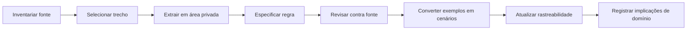

# Área de Trabalho — Rules & Content Discovery v0.1

**Status:** aprovado<br>
**Uso:** execução da descoberta<br>
**Estado da fase:** corpus inicial ingerido; Fatia 01 de regras aprovada<br>
**Início:** 2 de outubro de 2026<br>
**Última revisão de coerência:** 7 de outubro de 2026<br>
**Escopo inicial:** regras necessárias ao primeiro fluxo de rolagem V5

---

## 1. Objetivo da fase

Transformar fontes autorizadas em conhecimento revisado, especificações de regra e casos de teste que sustentem o Modelo de Domínio aprovado e a implementação do Rules Engine.

Esta pasta contém somente artefatos de trabalho que podem ser versionados. Livros, PDFs, extrações integrais e notas com conteúdo protegido permanecem em `fontes-privadas/`, ignorada pelo Git.

---

## 2. Resultado esperado

Ao final da fase será possível explicar, testar e rastrear:

```text
formação da parada
→ substituição por dados de Fome
→ dificuldade e bônus de crítico
→ resultado e falha especial
→ Evento de Sessão persistido
→ resultado autorizado no Feed da Mesa
```

## Especificações executáveis

- [Fatia 01 — índice e ordem de revisão](./especificacoes/fatia-01/README.md)
- [RULE-ROLL-001 — Formação da parada de dados](./especificacoes/fatia-01/rule-roll-001-composicao-parada.md)
- [RULE-HUNGER-001 — Dados de Fome na rolagem](./especificacoes/fatia-01/rule-hunger-001-participacao-dados-fome.md)
- [RULE-DIFF-001 — Definição da Dificuldade](./especificacoes/fatia-01/rule-diff-001-definicao-dificuldade.md)
- [RULE-CRIT-001 — Contagem de críticos](./especificacoes/fatia-01/rule-crit-001-contagem-criticos.md)
- [RULE-RESULT-001 — Sucessos, falha e margem](./especificacoes/fatia-01/rule-result-001-resolucao-resultado.md)
- [RULE-MESSY-001 — Crítico Bestial](./especificacoes/fatia-01/rule-messy-001-critico-bestial.md)
- [RULE-BESTIAL-001 — Falha Bestial](./especificacoes/fatia-01/rule-bestial-001-falha-bestial.md)
- [RULE-ROLLFLOW-001 — Ordem de resolução](./especificacoes/fatia-01/rule-rollflow-001-ordem-resolucao.md)

Sem depender de memória, interpretação informal ou texto enviado à IA em tempo de execução.

---

## 3. Artefatos vivos

- [Plano de descoberta de conteúdo e regras v0.1](./plano-descoberta-conteudo-regras-v0.1.md)
- [Inventário de fontes v0.1](./inventario-fontes-v0.1.md)
- [Linha normativa v0.1](./linha-normativa-v0.1.md)
- [Glossário controlado v0.1](./glossario-v0.1.md)
- [Catálogo de rastreabilidade v0.1](./catalogo-rastreabilidade-v0.1.md)
- [Registro de ambiguidades v0.1](./registro-ambiguidades-v0.1.md)
- [Checklist de revisão de regra](./checklist-revisao-regra.md)
- [Template de especificação](../99-modelos/regra-executavel-template.md)
- [Template de requisito do produto](../99-modelos/requisito-produto-template.md)

---

## 4. Gates do corpus

### Gate A — iniciar leitura e extração privada

- acesso legítimo ao exemplar confirmado;
- fonte identificada por `SRC-*`;
- edição e versão ou impressão identificáveis;
- original e extrações mantidos fora do Git.

Este gate permite inventariar e especificar regras candidatas. Não permite aprová-las nem publicar conteúdo.

### Gate B — aprovar uma regra

- edição e impressão exatas registradas;
- idioma normativo definido para divergências mecânicas;
- erratas aplicáveis verificadas;
- precedência resolvida entre as fontes que afetam a regra;
- regra opcional incluída ou excluída conscientemente;
- revisão humana concluída contra a fonte.

### Gate C — fechar texto de interface

- tradução oficial ou forma de trabalho escolhida;
- diferenças entre termo normativo e rótulo de interface registradas;
- glossário atualizado.

### Gate D — publicar ou distribuir conteúdo

- direitos correspondentes ao uso pretendido avaliados;
- conteúdo publicável separado do corpus privado;
- revisão final de citações, imagens e trechos.

---

## 5. Fluxo de trabalho



### Passo 1 — Inventariar

Registrar edição, versão, idioma, origem legítima, erratas e permissão de uso.

### Passo 2 — Selecionar

Ler somente as seções necessárias ao primeiro corte. Lore extensa permanece fora de escopo.

### Passo 3 — Extrair privadamente

Preservar o original sem copiá-lo para o Git. Notas versionadas devem ser paráfrases e estruturas próprias, respeitando os direitos aplicáveis.

### Passo 4 — Especificar

Descrever intenção, entradas, saídas, invariantes, autoridade humana, exceções e exemplos.

### Passo 5 — Revisar

Conferir termo por termo contra a fonte e eventuais erratas. IA não aprova uma regra.

### Passo 6 — Testar conceitualmente

Converter exemplos em Given/When/Then ou tabela de casos antes da implementação.

### Passo 7 — Rastrear

Atualizar o catálogo regra → especificação → fonte → cenário de teste.

### Passo 8 — Alimentar o domínio

Registrar entidades, Value Objects, invariantes e eventos sugeridos pela regra, sem escolher banco ou framework.

---

## 6. Estados de trabalho

Maturidade da especificação e estado da implementação são dimensões diferentes.

### Maturidade da regra

```text
CANDIDATA → ESPECIFICADA → REVISADA → APROVADA → SUBSTITUÍDA
```

### Estado de implementação

```text
NÃO INICIADA → IMPLEMENTADA → VERIFICADA
```

Uma regra pode estar aprovada sem ainda ter sido implementada. Uma implementação nunca torna uma especificação automaticamente correta.

Mudanças de edição ou errata podem mover uma regra novamente para revisão.

---

## 7. Limites

Nesta fase não será feito:

- importação de toda a lore;
- tradução integral de livros;
- implementação do Rules Engine;
- escolha final de framework;
- schema de banco;
- geração automática de regra a partir de PDF;
- publicação de conteúdo protegido.

---

## 8. Critérios para iniciar a especificação

Uma regra pode ser especificada quando:

- a fonte e a edição foram identificadas;
- o trecho relevante está acessível legitimamente;
- erratas aplicáveis foram procuradas;
- termos principais constam no glossário;
- o comportamento pertence ao escopo atual.

---

## 9. Critérios para concluir uma regra nesta fase

Uma regra termina esta fase quando:

- possui especificação própria e legível;
- aponta para fonte, capítulo e página;
- separa regra escrita de interpretação do sistema;
- explicita decisões de jogador e Narrador;
- registra exceções conhecidas;
- possui casos normais, limites e falhas;
- atualiza o catálogo de rastreabilidade;
- indica implicações para o Domain Model;
- foi revisada por uma pessoa contra a fonte.

---

## 10. Convenção de identificadores

```text
SRC-0001          fonte
TERM-PROD-001     termo do produto
TERM-GAME-001     termo do jogo
RULE-ROLL-001     regra de rolagem
RULE-HUNGER-001   regra de Fome
RULE-WILL-001     regra de Força de Vontade
RULE-ROLL-001-T01 cenário de teste conceitual da regra
REQ-ROLL-001      requisito interno do produto
REQ-ROLL-001-T01  cenário de aceitação do requisito
AMB-001           ambiguidade bloqueante ou relevante
```

Identificadores não devem carregar número de página ou edição, pois essas informações podem mudar sem alterar a identidade conceitual do item.

---

## 11. Consequências arquiteturais incorporadas e ainda verificáveis

O Modelo de Domínio v0.1 incorporou as decisões abaixo. A trilha de regras deve preservar sua evidência e verificar cada comportamento nas especificações, testes e ADRs correspondentes:

- identidade e versão do perfil deverão ser separadas em `ruleSetProfileId` e `ruleSetProfileRevisionId`;
- a resolução deverá ser determinística quando receber entradas e faces dos dados;
- geração aleatória deverá permanecer fora do núcleo puro da regra;
- cada tentativa confirmada deverá ser imutável e persistida antes da apresentação;
- uma tentativa persistida deverá registrar entradas relevantes, faces, versão das regras e resultado;
- um reroll futuro deverá criar nova tentativa e referenciar a anterior, sem sobrescrevê-la;
- julgamentos do Narrador deverão aparecer como decisões explícitas;
- proveniência deverá permanecer ligada à especificação e ao conhecimento, sem contaminar indiscriminadamente todos os objetos do jogo.

As decisões de tentativa imutável e histórico sem sobrescrita não serão reabertas silenciosamente. Qualquer correção nas demais hipóteses exige evolução versionada do Modelo de Domínio ou um ADR, conforme o alcance da mudança.

---

## 12. Primeira fatia funcional

O primeiro fluxo executável será um teste básico percorrido de ponta a ponta e coberto por cenários determinísticos. A estrutura abaixo delimita o trabalho; os detalhes mecânicos continuam dependentes das fontes:

1. selecionar um Personagem existente;
2. montar uma parada a partir de dois traços compatíveis, se essa composição for confirmada;
3. informar uma dificuldade conhecida e o valor atual de Fome;
4. fornecer faces determinísticas ao avaliador, separadas em dados normais e de Fome;
5. classificar integralmente o teste básico, inclusive resultados críticos ou especiais confirmados pelo corpus;
6. persistir o `RollAttempt` imutável, com entradas, faces, `ruleSetProfileRevisionId` e resultado;
7. criar um `SessionEvent` que referencia a tentativa persistida;
8. projetar o evento autorizado no Feed da Mesa.

Ficam fora desta fatia:

- testes resistidos;
- dificuldade secreta;
- Disciplinas, poderes e efeitos especiais;
- armas, dano e combate;
- ações rápidas ou testes especiais;
- modificadores contextuais ainda não confirmados;
- reroll com Força de Vontade;
- animação ou física de dados 3D.

---

## 13. Primeiro lote de regras

Ordem recomendada:

1. termos e fontes;
2. composição da parada;
3. dados de Fome;
4. dificuldade;
5. críticos e bônus de sucessos;
6. sucessos, falha e margem;
7. Crítico Bestial;
8. Falha Bestial;
9. composição e ordem do fluxo completo;
10. requisitos internos `REQ-*` para persistência do Evento de Sessão e projeção no Feed da Mesa.

O reroll com Força de Vontade permanece candidato para o incremento seguinte. Ele não bloqueia a primeira fatia e só será promovido quando elegibilidade, custo, limites e encerramento estiverem confirmados.

---

## 14. Estado atual

Livro Básico, Companion e Players Guide foram adicionados localmente, preservados fora do Git, inventariados e comparados. A fase não está mais bloqueada por corpus.

O próximo lote é transformar as regras do primeiro fluxo de rolagem em especificações próprias e cenários determinísticos, submetendo cada uma à aprovação humana antes da implementação.
