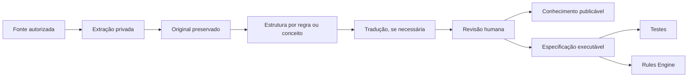

# Rules & Content Discovery Plan v0.1

**Status:** aprovado<br>
**Estado da fase:** corpus inicial ingerido; especificação executável em andamento<br>
**Data:** 1º de outubro de 2026  
**Edição inicial:** V5; corpus inicial confirmado com Livro Básico, Companion e Players Guide

---

## 1. Objetivo

Extrair evidências suficientes das fontes autorizadas para criar:

- sustentação e evolução versionada do Modelo de Domínio v0.1;
- Rules Engine Scope v0.1;
- glossário inicial;
- testes determinísticos do primeiro corte vertical;
- modelo de conhecimento com proveniência.

Não é objetivo desta fase importar todos os livros ou toda a lore.

---

## 2. Fronteiras da descoberta

### Trilha A — Produto

Já pode ser modelada a partir dos documentos internos:

- User;
- Character;
- Chronicle;
- Participação do Usuário;
- Vínculo de Personagem;
- Session;
- Scene;
- Permission;
- Resultado de Rolagem;
- Evento de Sessão;
- Feed da Mesa;
- Trilha de Auditoria.

### Trilha B — Game Rules

Exige leitura de fontes autoritativas:

- Trait;
- Dice Pool;
- Hunger;
- Difficulty;
- Roll;
- Roll Result;
- Critical;
- Messy Critical;
- Bestial Failure.

`Willpower Reroll` pertence ao incremento seguinte e não bloqueia a primeira fatia.

### Trilha C — Knowledge e Lore

Nesta fase, modelar apenas a infraestrutura conceitual:

- Source;
- Edition;
- Chapter;
- Page Reference;
- Content Fragment;
- Translation;
- Glossary Term;
- Visibility;
- Citation.

Lore extensa será incorporada incrementalmente, depois do primeiro motor de regras.

---

## 3. Corpus mínimo

Selecionar somente trechos necessários para responder:

1. como uma parada de dados é formada?
2. quando dados de Fome substituem dados normais?
3. como dificuldade e sucessos funcionam?
4. como críticos são identificados e contabilizados?
5. o que caracteriza Crítico Bestial?
6. o que caracteriza Falha Bestial?
7. quem define modificadores e dificuldade?
8. quais decisões permanecem com o Narrador?

Para o incremento seguinte, ampliar o corpus somente o necessário para confirmar elegibilidade, custo, limites e encerramento do reroll com Força de Vontade.

---

## 4. Organização local das fontes

Estrutura sugerida, ignorada pelo Git:

```text
fontes-privadas/
├── inventario-local.md
├── v5/
│   ├── original/
│   ├── pt-br/
│   └── extracoes/
└── notas-locais/
```

Não usar essa pasta como produto final nem como fonte pública.

---

## 5. Inventário de fontes

Para cada obra, registrar:

| Campo | Descrição |
|---|---|
| source_id | identificador interno estável |
| título | título oficial |
| edição | V5, V20 ou outra |
| versão | impressão, errata ou revisão |
| idioma | idioma da fonte |
| publicador | responsável pela publicação |
| acesso legítimo | confirmação de que a equipe pode consultar o exemplar |
| uso permitido | privado, citação, implementação ou distribuição |
| escopo | capítulos relevantes |
| prioridade | primeiro corte ou futuro |

---

## 6. Pipeline de conteúdo



### Separações obrigatórias

- original não é sobrescrito;
- tradução não substitui proveniência;
- resumo não vira regra executável automaticamente;
- IA pode auxiliar extração, nunca aprovar regra sozinha;
- regra executável precisa de exemplos e testes.

Fontes integrais protegidas e extrações extensas não serão enviadas a serviços externos de IA sem avaliação explícita de licença, privacidade, retenção e autorização. Na ausência dessa avaliação, a assistência externa fica restrita a metadados públicos, paráfrases sanitizadas e estruturas produzidas pela equipe.

---

## 7. Estados de uma regra

Maturidade da especificação:

| Estado | Significado |
|---|---|
| candidata | comportamento necessário, ainda não confirmado |
| especificada | entradas, saídas, invariantes e casos registrados |
| revisada | conferida por uma pessoa contra fonte e errata |
| aprovada | pronta para planejamento de implementação |
| substituída | outra versão ou decisão assumiu precedência |

Estado de implementação:

| Estado | Significado |
|---|---|
| não iniciada | ainda não existe no Rules Engine |
| implementada | comportamento presente no código |
| verificada | implementação passou pelos testes e revisão definidos |

---

## 8. Catálogo de rastreabilidade

Toda regra normativa implementada deverá permitir o caminho:

```text
Comportamento no sistema
→ teste automatizado
→ especificação estruturada
→ interpretação revisada
→ fonte, edição, capítulo e página
```

Todo requisito interno implementado deverá permitir o caminho:

```text
Comportamento no sistema
→ teste automatizado
→ critério de aceitação
→ decisão de produto aceita
```

Não implementar mecânica ou requisito sem a rastreabilidade correspondente.

---

## 9. Glossário inicial

Campos:

- termo original;
- termo PT-BR;
- edição;
- fonte;
- definição curta;
- estado da tradução;
- aliases de busca;
- observações de uso.

Estados sugeridos:

- oficial;
- revisado internamente;
- provisório;
- tradução por IA não revisada;
- depreciado.

---

## 10. Critérios de qualidade

Uma especificação está pronta quando:

- identifica edição e fonte;
- separa regra de exemplo narrativo;
- descreve entradas e saídas;
- explicita escolhas do jogador;
- explicita autoridade do Narrador;
- registra exceções;
- possui exemplos normais e limítrofes;
- pode ser convertida em testes;
- não depende de texto protegido no runtime para funcionar.

---

## 11. Direitos e uso

Antes de qualquer conteúdo entrar no produto ou no GitHub, classificar:

- o que pode ser armazenado privadamente;
- o que pode ser resumido;
- o que pode ser exibido;
- o que pode ser traduzido;
- o que pode ser distribuído;
- quais marcas e imagens exigem licença.

Na ausência de autorização clara, manter o material original fora do repositório.

---

## 12. Entregáveis

1. inventário de fontes;
2. glossário v0.1;
3. conjunto mínimo de especificações;
4. catálogo de rastreabilidade;
5. lista de ambiguidades;
6. cenários de teste;
7. Rules & Content Discovery Report v0.1;
8. recomendações para a evolução do Modelo de Domínio.

---

## 13. Critérios de conclusão da fase

A fase termina quando:

- o teste básico, sem reroll, está completamente explicado e classifica todos os resultados previstos no recorte;
- as regras possuem proveniência;
- as exceções relevantes foram identificadas;
- os exemplos principais viraram cenários de teste;
- termos PT-BR estão controlados;
- o conteúdo permitido no Git está separado do corpus privado;
- o Modelo de Domínio pode evoluir sem inventar a mecânica.
