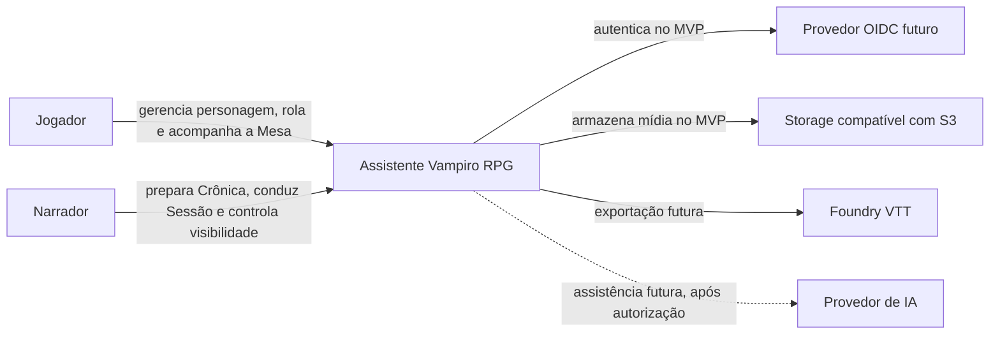
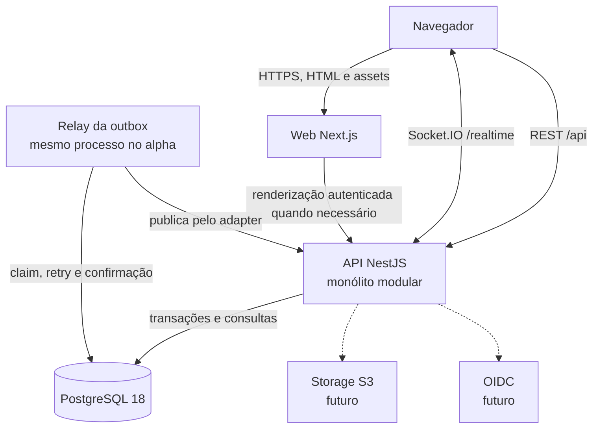
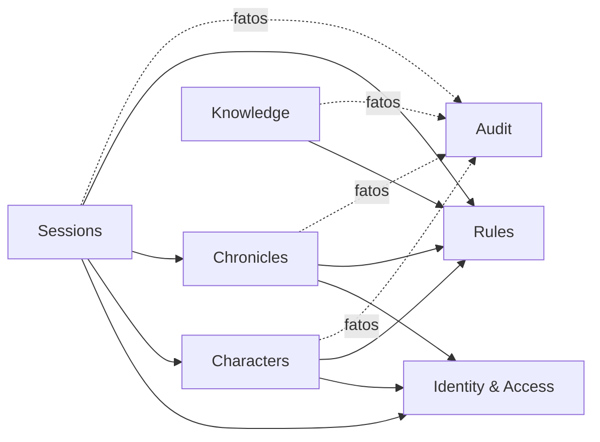
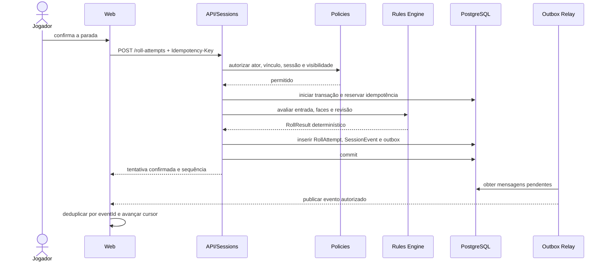

# Architecture v0.1 — Arquitetura de Software

**Status:** aprovada<br>
**Data:** 8 de outubro de 2026<br>
**Escopo:** alpha técnico e preparação do MVP de playtest<br>
**Decisões de base:** DEC-001 a DEC-050; ADR-0001 a ADR-0005<br>

---

## 1. Propósito e autoridade

Este documento transforma o modelo de produto e de domínio em limites técnicos implementáveis. Ele governa o primeiro esqueleto do sistema depois de aprovado. Não redefine regras de jogo, conteúdo editorial nem identidade visual.

Fontes de autoridade:

- [Fundação de Produto e Experiência v0.2](../01-produto/fundacao-produto-experiencia-v0.2.md);
- [Arquitetura de Produto e Fluxos Principais v0.1](../01-produto/arquitetura-produto-fluxos-principais-v0.1.md);
- [Modelo de Domínio v0.1](./dominio/modelo-dominio-v0.1.md);
- [Pesquisa de Benchmarks v0.1](./pesquisa-benchmarks-plataformas-rpg-v0.1.md);
- [Padrões de Qualidade de Engenharia v0.1](../00-governanca/padroes-qualidade-engenharia-v0.1.md);
- [Escopo do Alpha Técnico v0.1](../05-planejamento/escopo-alpha-tecnica-v0.1.md).

Quando um detalhe deste documento conflitar com um ADR aceito posterior, o ADR prevalece.

## 2. Resumo executivo

O sistema nasce como monólito modular TypeScript em monorepo:

- Next.js 16 e React no frontend;
- NestJS 12 no backend autoritativo;
- PostgreSQL 18 como fonte de verdade;
- Kysely com `pg` nos adapters de persistência e nas migrações;
- REST/OpenAPI para comandos e consultas;
- outbox transacional e Socket.IO por adapter para eventos em tempo real;
- Rules Engine puro, determinístico e executado no servidor;
- infraestrutura portável, baseada em containers e interfaces para serviços externos.

O primeiro incremento prova uma rolagem do comando ao Feed. IA, chat livre, mapa tático e integração Foundry ficam fora do alpha.

## 3. Drivers e atributos de qualidade

| Atributo | Decisão verificável |
|---|---|
| manutenção | módulos por capacidade, nomes do domínio e dependências testadas |
| segurança | negação por padrão; autorização antes de leitura, regra ou publicação |
| confiabilidade | transação com outbox, idempotência, retry, replay e deduplicação |
| portabilidade | PostgreSQL padrão, containers e adapters de fornecedor |
| acessibilidade | HTML semântico, teclado, foco, contraste e movimento reduzido |
| performance | carga progressiva de mídia e catálogos; nada de corpus completo no cliente |
| rastreabilidade | IDs e versões ligam comando, regra, evento, usuário e release |
| testabilidade | domínio puro, relógio e aleatoriedade injetados, PostgreSQL real em integração |

Metas numéricas serão definidas quando existir medição real. Não haverá SLO fictício antes do primeiro ambiente compartilhado.

## 4. Escopo e não objetivos

### Alpha técnico

Executa o fluxo definido em [Escopo do Alpha Técnico v0.1](../05-planejamento/escopo-alpha-tecnica-v0.1.md) com dados fictícios e identidade controlada.

### MVP de playtest

Acrescenta autenticação real, acabamento do fluxo, operação compartilhada, backup testado e uso por grupo convidado.

### Não objetivos desta versão

- microsserviços;
- VTT tático;
- chat, voz ou vídeo;
- IA em produção;
- banco vetorial;
- Kubernetes;
- sincronização bidirecional com Foundry;
- ingestão de livros em runtime.

## 5. Contexto do sistema — C4 nível 1



Fronteiras de confiança:

- navegador é não confiável;
- identidade autenticada não implica autorização na Crônica;
- storage, VTT e IA são sistemas externos;
- corpus privado não cruza uma fronteira sem política e autorização explícitas.

## 6. Containers — C4 nível 2



Em produção, um ingress expõe web, `/api` e `/realtime` sob a mesma origem. Localmente, portas diferentes usam uma allowlist de origem explícita. O navegador nunca recebe credencial de banco.

## 7. Topologia por ambiente

| Ambiente | Identidade | Dados | Serviços externos | Permitido |
|---|---|---|---|---|
| local | adapter fictício | PostgreSQL local, seed fictício | stubs | desenvolvimento |
| test/CI | adapter fictício | PostgreSQL efêmero real | fakes determinísticos | testes automatizados |
| alpha local | adapter fictício | PostgreSQL local | realtime real | demonstração técnica |
| compartilhado | OIDC obrigatório | PostgreSQL gerenciado | storage e observabilidade aprovados | playtest convidado |

O processo falha ao iniciar se identidade fictícia estiver selecionada fora de `local`, `test` ou `ci`.

## 8. Estrutura do monorepo

```text
apps/
  web/                         # Next.js; composição da experiência
  api/                         # NestJS; autoridade da aplicação
    src/modules/
      identity-access/
      characters/
      chronicles/
      sessions/
      rules/
      knowledge/
      audit/
packages/
  ui/                          # tokens e componentes visuais
  contracts/                   # cliente OpenAPI e schemas públicos de eventos
  rules-engine/                # núcleo puro; importável apenas no servidor
  config/                      # lint, TypeScript e testes
database/
  migrations/
  seeds/
infrastructure/
  docker/
  observability/
documentacao/
```

Não haverá pasta `shared` genérica. Um pacote só nasce quando possui consumidores reais, responsabilidade única e proprietário claro.

## 9. Monólito modular

### Módulos e APIs públicas

| Módulo | Possui | Expõe |
|---|---|---|
| Identity & Access | Conta, identidade e contexto do ator | `ActorContext`, portas de identidade |
| Characters | personagem, ficha, rascunho e progressão | consultas e comandos de personagem |
| Chronicles | Crônica, Participação, Vínculo e Coterie | políticas e consultas de acesso à Crônica |
| Sessions | Sessão, Cena, rolagem, Evento e Feed | casos de uso do jogo em andamento |
| Rules | catálogo, perfil e avaliação | `RuleSetResolver`, `RollEvaluator` |
| Knowledge | artigos, glossário, citações e busca | consulta editorial já autorizada |
| Audit | trilha de ações sensíveis | sink de auditoria; consulta administrativa restrita |

### Dependências permitidas



Cada módulo acessa dados de outro módulo por API de aplicação, query dedicada ou evento. Importar entidade interna, repositório concreto ou tabela de outro módulo é proibido.

Critérios para extrair um serviço no futuro:

- necessidade independente de escala ou disponibilidade medida;
- fronteira estável e baixa dependência transacional;
- equipe capaz de operar comunicação, observabilidade e deploy separados;
- benefício maior que o custo distribuído, registrado em ADR.

## 10. Organização interna de um módulo

```text
module-name/
  domain/          # entidades, value objects, políticas e eventos
  application/     # casos de uso, portas e transações
  adapters/        # HTTP, banco, mensageria e serviços externos
  module.ts        # composição do NestJS
```

Regras:

- domínio não importa NestJS, ORM, Socket.IO, SDK de IA ou HTTP;
- application coordena o caso de uso e a fronteira transacional;
- adapters traduzem tecnologia para portas internas;
- DTO externo não atravessa diretamente para entidade;
- comentários explicam motivo, invariante ou risco; não narram sintaxe evidente;
- nomes completos e termos do glossário prevalecem sobre abreviações locais.

## 11. Arquitetura do frontend

### Responsabilidades

- composição das rotas e layouts;
- apresentação de estados carregando, vazio, erro, negado e desconectado;
- acessibilidade e adaptação responsiva;
- cache de dados remotos sem se tornar fonte de verdade;
- conexão realtime, deduplicação visual e retomada;
- design system e integração progressiva de arte.

### Server e Client Components

Server Components servem conteúdo estável e composição inicial quando não dependem de interação contínua. Client Components ficam restritos a formulários, trackers, Roll Builder, Feed vivo e elementos que exigem estado do navegador.

Nenhum componente chama PostgreSQL. Nenhum componente calcula o resultado canônico de uma rolagem. Uma prévia local pode orientar a interface, mas é rotulada como prévia e nunca substitui a resposta do servidor.

### Estado

- estado remoto vem da API e possui chaves por recurso;
- estado efêmero da interface fica próximo do componente;
- rascunhos recuperáveis são persistidos pela API;
- o Feed mantém cursor da última sequência confirmada;
- não criar store global antes de existir estado realmente global.

### Design system

Tokens próprios controlam tipografia, cor, espaço, contraste, elevação, textura e movimento. Radix fornece primitivas de comportamento; não define a aparência. Toda tela funciona sem arte carregada e respeita `prefers-reduced-motion`.

Storybook documenta, no mínimo: padrão, hover, foco, desabilitado, carregando, vazio, erro e permissão negada.

## 12. Arquitetura do backend

O backend é a única autoridade para:

- autorização;
- regras executáveis;
- transações e idempotência;
- geração ou aceitação controlada das faces;
- visibilidade dos Eventos de Sessão;
- emissão de eventos realtime;
- auditoria.

Casos de uso recebem `ActorContext`, comando validado e dependências por porta. Respostas de erro usam um envelope estável com código, mensagem segura, `correlationId` e detalhes de campo quando aplicáveis. Stack trace e causa interna não saem da API.

## 13. Rules Engine

`packages/rules-engine` é puro e determinístico:

```text
RollInput + DiceFaces + RuleSetProfileRevision
                    ↓
               RollResult
```

O pacote:

- recebe relógio, aleatoriedade ou faces por parâmetro quando necessários;
- não lê banco, PDF, artigo, variável de ambiente ou rede;
- usa IDs canônicos de regra e revisão;
- devolve decisões estruturadas, não texto narrativo definitivo;
- possui testes tabelados derivados de especificações `RULE-*` aprovadas.

Ele é server-only. O frontend usa schemas e descrições públicas, nunca importa o avaliador para decidir o resultado oficial.

## 14. Arquitetura de dados

### Modelo lógico mínimo do alpha

- `account`;
- `character` e revisão otimista;
- `chronicle`;
- `chronicle_membership`;
- `character_binding`;
- `game_session` e `scene`;
- `rule_set_profile_revision`;
- `roll_attempt` append-only;
- `session_event` append-only;
- `session_stream`;
- `outbox_message`;
- `audit_entry`.

### Restrições obrigatórias

- UUIDv7 gerado pela aplicação para novos identificadores internos, conforme ADR-0005;
- idempotência de rolagem única por Conta atuante, Sessão, versão da operação e chave, com impressão digital obrigatória;
- no máximo um Vínculo ativo por personagem na v0.1;
- sequência única e crescente por stream de Sessão;
- `RollAttempt` e `SessionEvent` confirmados não recebem `UPDATE` destrutivo;
- chaves estrangeiras e checks representam invariantes que o banco consegue garantir;
- `jsonb` somente para snapshot ou payload evolutivo justificado;
- datas persistidas em UTC e apresentadas no fuso do usuário.

A sequência do stream não será obtida por `MAX(sequence) + 1`. Uma linha de cursor da Sessão é bloqueada e incrementada dentro da transação.

Migrações são imutáveis depois de aplicadas em ambiente compartilhado. Correções entram em nova migração. A CI cria banco vazio e executa todas as migrações.

## 15. Contratos

### HTTP

- REST JSON sob `/api/v1`;
- OpenAPI é a fonte do contrato público;
- cliente TypeScript é gerado, não escrito duas vezes;
- comandos mutáveis relevantes aceitam `Idempotency-Key`;
- a API calcula uma impressão SHA-256 da versão da operação e do comando validado em forma canônica, sem IDs gerados pelo servidor nem `correlationId`;
- a mesma chave no mesmo contexto recupera a resposta original somente se a impressão for igual; outra impressão produz conflito;
- paginação usa cursor quando a ordem precisa ser estável.

### Eventos públicos

Envelope mínimo:

```json
{
  "eventId": "uuid",
  "eventType": "session.roll-result-recorded.v1",
  "occurredAt": "2026-10-08T00:00:00Z",
  "streamId": "session-id",
  "sequence": 42,
  "correlationId": "uuid",
  "payload": {}
}
```

Adicionar campo opcional é evolução compatível. Remover, renomear ou alterar significado exige nova versão de evento.

## 16. Sequência da rolagem



Se a chave já existir no mesmo contexto com a mesma impressão do comando, inclusive durante requisições concorrentes, a API devolve a resposta original. Se existir com outra impressão, devolve conflito. Falha antes do `commit` não produz fato; falha depois do `commit` é recuperada pelo relay.

## 17. Outbox, realtime e Feed

- outbox é gravada na mesma transação do fato;
- relay faz claim com lock e prazo de lease;
- falha aplica backoff limitado e registra a causa segura;
- publicação repetida é aceitável; perda silenciosa não;
- cliente deduplica por `eventId`;
- cada inscrição valida a participação e o público permitido;
- reconexão informa a última sequência e recebe a lacuna por HTTP ou canal autenticado;
- Feed é projeção de eventos autorizados, não log técnico e não chat.

Redis ou broker externo só entra por evidência de carga, múltiplas instâncias ou isolamento. O evento canônico não adota o formato do Socket.IO.

## 18. Identidade, autorização e visibilidade

Autenticação responde “quem é”. Autorização responde “o que pode fazer aqui”. Todo caso de uso sensível avalia:

```text
ator + papel na Crônica + recurso + ação + estado + visibilidade
```

Controles:

- negar por padrão;
- consultar o mínimo necessário para decidir acesso;
- filtrar campos no servidor antes de serializar;
- autorizar conexão, inscrição e comando realtime separadamente;
- registrar negações relevantes sem gravar conteúdo secreto;
- testar acessos horizontais e verticais negativos.

A matriz detalhada de permissões foi aprovada e continua obrigatória para os casos de uso. No alpha, o adapter fictício segue ADR-0003; no MVP, OIDC e sessão em cookie seguro exigem ADR próprio.

## 19. Segurança, privacidade e conteúdo protegido

- segredos chegam por configuração externa e nunca pelo repositório;
- cookies futuros usam `HttpOnly`, `Secure` e `SameSite` definido no ADR de identidade;
- origem, CSRF e rate limits são tratados na borda apropriada;
- logs aplicam allowlist de campos e redaction;
- PDFs e extrações ficam em `fontes-privadas/`, fora de build e runtime;
- especificações de regra próprias guardam somente o necessário e sua proveniência;
- backup, restauração e retenção são obrigatórios antes do ambiente compartilhado;
- dependências passam por auditoria e atualização controlada.

## 20. Observabilidade e auditoria

Toda requisição e evento recebe `correlationId`. Logs estruturados incluem ambiente, versão da aplicação, caso de uso, duração, resultado e IDs não sensíveis.

Métricas iniciais:

- latência e taxa de erro por caso de uso;
- conflitos de idempotência;
- idade e tamanho da outbox;
- tentativas e falhas do relay;
- diferença entre última sequência persistida e entregue;
- conexões e rejeições realtime.

Auditoria é append-only e separada do Feed. Ela registra ator, ação, recurso, decisão, horário e versão, sem copiar conteúdo reservado desnecessário.

## 21. Preparação para IA

A aplicação futura dependerá de uma porta `AiAssistant`, não de um SDK específico:

```text
caso de uso
→ autorização e seleção de fontes
→ redaction e política
→ porta AiAssistant
→ adapter do provedor
```

Proveniência e citações são obrigatórias. Nenhum modelo decide regra, cânone, permissão ou segredo. IA não é implementada no alpha e a arquitetura não exige vector database.

## 22. Integrações futuras

Foundry receberá exportações versionadas a partir do modelo canônico. Cada adapter declara:

- versão do formato;
- versões compatíveis do destino;
- campos suportados e ignorados;
- perdas conhecidas;
- resultado e erros de importação/exportação.

Integração externa nunca recebe acesso direto às tabelas internas.

## 23. Estratégia de testes

| Nível | Protege |
|---|---|
| unidade | value objects, políticas e Rules Engine puro |
| integração | repositórios, migrações, transações e locks em PostgreSQL real |
| contrato | OpenAPI, cliente gerado e schemas de evento |
| arquitetura | imports e dependências proibidas |
| ponta a ponta | comando até Feed, falha e reconexão |
| segurança | autorização negativa, enumeração, campos secretos e sessão |
| acessibilidade | semântica, teclado, foco, contraste e movimento reduzido |

Testes de regra usam exemplos rastreados às especificações. Snapshot não substitui asserção de comportamento.

## 24. Gates de CI

Cada mudança de código deve passar por:

1. instalação com lockfile;
2. formatação e lint;
3. typecheck;
4. testes unitários;
5. testes de arquitetura;
6. geração e verificação de contratos;
7. migração em PostgreSQL vazio;
8. testes de integração;
9. build de web e API;
10. varredura de segredos e dependências;
11. ponta a ponta do fluxo crítico quando aplicável.

Comentários e documentação são revisados como código: precisam explicar decisões reais e permanecer corretos.

## 25. Implantação, migração e recuperação

Web e API geram imagens separadas e imutáveis. Migração roda como etapa controlada antes da nova versão receber tráfego; não durante o startup concorrente de todas as réplicas.

Mudanças de banco seguem expansão e contração quando houver compatibilidade entre versões. Rollback de aplicação nunca pressupõe rollback destrutivo do banco.

Antes do playtest compartilhado:

- backup automático configurado;
- restauração executada e medida;
- segredos rotacionáveis;
- health, readiness e observabilidade ativos;
- runbook mínimo de falha do banco e da outbox.

## 26. Plano de evolução

| Etapa | Entrega | Gate de saída |
|---|---|---|
| 1. decisões | ADRs aceitos e arquitetura revisada | nenhum bloqueio estrutural aberto |
| 2. prova de dados | comparação Kysely/Drizzle/Prisma | ADR-0004 aceito |
| 3. foundation | monorepo, CI, containers, migrações e observabilidade | setup limpo reproduzível |
| 4. alpha | rolagem completa até Feed e reconexão | critérios do alpha verdes |
| 5. MVP privado | identidade real, UX e operação compartilhada | playtest autorizado e recuperável |
| 6. evolução | criação, cenas, Biblioteca e relações | métricas e pesquisa de usuário |
| 7. IA e integrações | adapters avaliados por caso | segurança, licença e qualidade aprovadas |

Gatilhos objetivos:

- broker externo: backlog/latência ou múltiplas instâncias comprovarem necessidade;
- cache distribuído: consulta medida não atender meta após otimização do banco;
- `pgvector`: busca textual e metadados não resolverem um caso aprovado;
- microsserviço: escala, disponibilidade e autonomia justificarem o custo;
- WebGL: protótipo demonstrar ganho de experiência com fallback acessível.

## 27. Pendências controladas

| Pendência | Bloqueia | Resolução |
|---|---|---|
| provedor OIDC | ambiente compartilhado | ADR antes do MVP |
| storage de mídia | upload real | ADR quando o fluxo entrar no corte |
| política jurídica de conteúdo | publicação de conteúdo derivado | análise própria antes do uso público |

Nenhuma pendência acima autoriza solução provisória escondida no código.

## 28. Definition of Done da Architecture v0.1

- [x] stack, estilo e fonte de verdade registrados;
- [x] contexto, containers e módulos definidos;
- [x] dependências permitidas e proibidas explícitas;
- [x] fluxo de rolagem, outbox, replay e idempotência descritos;
- [x] fronteiras de frontend, backend, regras e dados definidas;
- [x] segurança, observabilidade, testes e implantação consideradas;
- [x] evolução futura possui adapters e gatilhos objetivos;
- [x] matriz de permissões aprovada;
- [x] prova de persistência concluída;
- [x] ADR-0004 revisada e aceita;
- [x] oito regras executáveis da Fatia 01 aprovadas após revisão humana;
- [x] ADR-0005 revisada e aceita;
- [x] revisão humana deste documento concluída.

A Architecture v0.1 foi aprovada pelo responsável do produto em 8 de outubro de 2026. A Engineering Foundation está autorizada a criar o esqueleto, a CI, as migrações e a infraestrutura local dentro destes limites. Funcionalidades fora do corte continuam sujeitas aos seus próprios gates.
