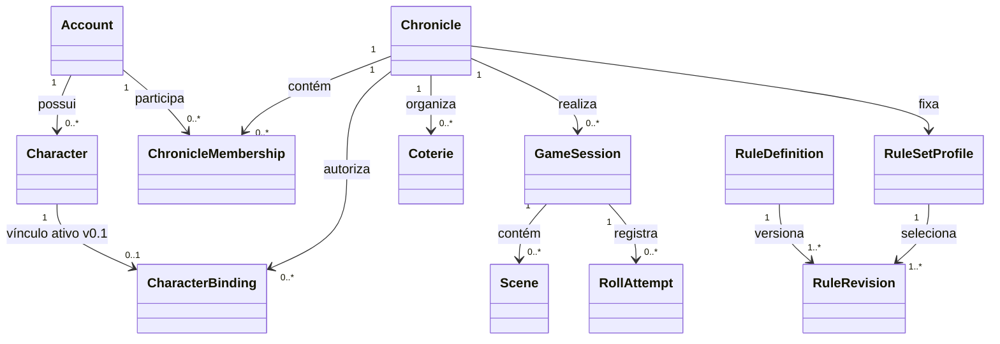

# Modelo de Domínio v0.1

**Status:** aprovado<br>
**Data:** 6 de outubro de 2026<br>
**Data de aprovação:** 6 de outubro de 2026<br>
**Última revisão de coerência:** 7 de outubro de 2026<br>
**Base:** Product Architecture v0.1 e perfil de regras `v5-core-companion-pg-2023`<br>
**Próximo documento:** Permissions & Visibility Matrix v0.1

---

## 1. Decisão central

O sistema será modelado como um monólito modular no início. Os limites abaixo são limites de negócio e código, não serviços de rede.

> Personagem, Crônica, Sessão, Regras e Biblioteca possuem responsabilidades diferentes. Eles podem viver na mesma aplicação sem compartilhar modelos internos nem fontes de verdade.

O objetivo desta versão é definir entidades, agregados, invariantes e eventos antes de escolher banco, framework ou provedor de nuvem.

## 2. Linguagem do domínio

| Termo | Significado no sistema |
|---|---|
| Conta | identidade autenticada de uma pessoa |
| Personagem | identidade jogável de propriedade da Conta, capaz de existir sem Crônica |
| Tipo de Personagem | vampiro de clã, Caitiff, Sangue-Ralo, carniçal ou mortal |
| Crônica | campanha compartilhada com membros, regras e conteúdo próprios |
| Participação | relação entre Conta e Crônica, com papéis e permissões |
| Vínculo de Personagem | autorização para um Personagem atuar em uma Crônica |
| Coterie | grupo ficcional e mecânico de personagens dentro da Crônica |
| Sessão | intervalo formal de jogo de uma Crônica |
| Cena | contexto narrativo ativo ou preparado dentro da Sessão |
| Tentativa de Rolagem | registro imutável de uma rolagem confirmada |
| Resultado de Rolagem | interpretação determinística das faces segundo uma revisão de regras |
| Evento de Sessão | fato autorizado apresentado no Feed da Mesa |
| Regra | identidade conceitual estável de um comportamento mecânico |
| Revisão de Regra | versão imutável da mecânica e de sua proveniência |
| Perfil de Regras | conjunto fechado de revisões e módulos opcionais usado por uma Crônica |
| Biblioteca | apresentação editorial de regra ou lore; não executa mecânica |

## 3. Módulos

| Módulo | Responsabilidade | Não pode fazer |
|---|---|---|
| Identidade e Acesso | contas, autenticação e identidade da pessoa | decidir regra do jogo |
| Personagens | criação, ficha, estado e progressão | conceder acesso a uma Crônica |
| Crônicas | campanha, participação, vínculos, coteries e visibilidade | calcular resultado de dados |
| Sessões | sessão, cena, comandos e Feed da Mesa | interpretar PDF ou texto editorial |
| Regras | catálogo, perfis, validação e avaliação determinística | autorizar segredo narrativo |
| Conhecimento | Biblioteca, lore, busca, citações e localização | tornar uma paráfrase em regra executável |
| Auditoria | ações sensíveis e evidência operacional | aparecer como feed narrativo por padrão |

Dependências permitidas:

```text
Identidade ← Personagens
Identidade ← Crônicas
Regras ← Personagens
Regras ← Crônicas
Personagens + Crônicas + Regras → Sessões
Conhecimento consulta Regras por identificador público
Auditoria recebe fatos dos demais módulos
```

O módulo de Regras não depende de Personagens ou Sessões concretos. Ele recebe valores de entrada e devolve decisões mecânicas.

## 4. Visão dos agregados



As setas descrevem relações de domínio, não chaves estrangeiras definitivas.

## 5. Agregado `Character`

### Responsabilidade

Manter a identidade jogável, o estado mecânico próprio e a consistência da ficha.

### Estado principal

- `characterId`;
- `ownerAccountId`;
- nome, conceito, Ambição e Desejo;
- `characterKind`;
- estado de criação: `draft`, `ready`, `retired`;
- edição e revisão do perfil usadas na validação mais recente;
- Características e Especializações;
- Humanidade, Vitalidade e Força de Vontade;
- Fome, Geração e Potência do Sangue quando aplicáveis;
- clã, Perdição e Compulsão quando aplicáveis;
- Disciplinas e poderes;
- Vantagens e Defeitos;
- Convicções e vínculos com Pilares;
- histórico de revisões relevantes da ficha.

### Tipos e capacidades

`characterKind` não é uma hierarquia de classes. O perfil de regras determina capacidades.

| Tipo | Clã | Fome | Potência do Sangue | Pontos de Disciplina | Tipo de Predador |
|---|---|---|---|---|---|
| `CLAN_VAMPIRE` | obrigatório | sim | sim | sim | permitido |
| `CAITIFF` | proibido | sim | sim | sim, com custo próprio | permitido |
| `THIN_BLOOD` | proibido | sim | normalmente 0 | não intrínsecos | não adquirido no início |
| `GHOUL` | proibido | não | não | proibidos; poderes concedidos separadamente | proibido |
| `MORTAL` | proibido | não | não | proibidos | proibido |

As restrições vêm de políticas versionadas. A entidade guarda o estado; o perfil decide se ele é válido.

### Invariantes iniciais

1. O proprietário do Personagem não muda sem uma operação explícita e auditada.
2. Um Personagem `ready` referencia uma revisão fechada de perfil.
3. Valores de Características usam tipos próprios e limites do perfil; não são inteiros livres.
4. Um poder selecionado referencia uma `RuleRevision`, não um nome traduzido.
5. Um vampiro não pode selecionar poder acima do nível disponível na Disciplina.
6. Um carniçal não possui pontos de Disciplina, mesmo quando usa um poder.
7. Vantagens e Defeitos preservam custo e revisão aplicados no momento da validação.
8. Mudança de perfil não reescreve automaticamente uma ficha existente; gera uma proposta de migração.

### Convicções e Pilares

- zero a três Convicções no perfil de 2023;
- uma Convicção possui exatamente um vínculo ativo com Pilar;
- o número de Pilares ativos é igual ao número de Convicções;
- Pilar é uma pessoa mortal, viva e sem Sangue vampírico;
- morte, Abraço, transformação em carniçal ou ruptura do significado encerra o vínculo;
- encerrar um vínculo preserva o histórico;
- substituir um Pilar é uma operação de domínio, não edição direta de texto.

### Criação

A criação usa `CharacterDraft`, um fluxo recuperável que pode ficar incompleto. Publicar o rascunho executa todas as políticas do perfil e produz `CharacterCreated`.

O rascunho pode guardar escolhas inválidas temporariamente. O Personagem `ready` não.

## 6. Participação e Vínculo

### `ChronicleMembership`

Relaciona Conta e Crônica.

- possui um ou mais papéis explícitos: `PLAYER`, `STORYTELLER`;
- possui estado: `invited`, `active`, `suspended`, `left`;
- não referencia obrigatoriamente um Personagem;
- é a origem das permissões de alto nível.

Uma pessoa pode acumular os papéis de Jogador e Narrador somente quando a Crônica permitir e a atribuição for explícita.

### `CharacterBinding`

Relaciona Personagem, Participação e Crônica.

- exige Participação ativa;
- possui estado: `requested`, `approved`, `active`, `released`, `rejected`;
- identifica quem solicitou e quem aprovou;
- define a Coterie, quando houver;
- guarda apelidos e anotações que pertencem apenas à Crônica;
- não transfere a propriedade do Personagem.

### Decisão de escopo v0.1

Um Personagem pode ter no máximo um Vínculo ativo. Para jogar o mesmo conceito em outra Crônica, o usuário cria uma cópia explícita com `forkedFromCharacterId`.

Isso evita que dano, experiência, Humanidade e histórico de duas campanhas modifiquem silenciosamente a mesma ficha. Suporte a múltiplos vínculos ativos exigirá um ADR e um modelo explícito de estado por Crônica.

## 7. Agregado `Chronicle`

### Responsabilidade

Manter identidade, ciclo de vida e políticas comuns da campanha.

### Estado principal

- `chronicleId` e proprietário administrativo;
- título e descrição;
- estado: `draft`, `active`, `archived`;
- `ruleSetProfileRevisionId` fixado;
- política de papéis e aprovação de vínculos;
- política de visibilidade padrão;
- módulos opcionais habilitados;
- Coteries associadas.

### Invariantes

1. Uma Crônica ativa sempre referencia um perfil publicado e imutável.
2. Alterar perfil cria uma migração planejada; não troca resultados passados.
3. Arquivar não apaga Sessões, vínculos ou eventos.
4. Conteúdo secreto do Narrador é negado por padrão.
5. Vínculo só fica ativo se Participação, Personagem e perfil forem compatíveis.

## 8. Agregado `Coterie`

### Estado

- `coterieId` e `chronicleId`;
- tipo de coterie, quando escolhido;
- propósito;
- membros por `CharacterBindingId`;
- Vantagens, Defeitos, Domínio e Qualidades de Coterie;
- revisão de regra de cada opção.

### Invariantes

- só aceita vínculos ativos da mesma Crônica;
- requisitos de clã ou tipo de personagem são avaliados pelo perfil;
- benefícios de uma Qualidade não são copiados para cada Personagem;
- mudança do tipo de coterie produz histórico e revalidação.

As dezesseis Qualidades catalogadas serão dados de regra. Não haverá `if clan == ...` em componentes ou casos de uso.

## 9. Agregados `GameSession` e `Scene`

### `GameSession`

- pertence a uma Crônica;
- estados: `scheduled`, `active`, `ended`, `cancelled`;
- registra início, encerramento e participantes presentes;
- possui no máximo uma Cena ativa no primeiro corte;
- não contém o histórico completo como uma coleção carregada em memória.

### `Scene`

- pertence a uma Sessão;
- estados: `prepared`, `active`, `closed`;
- define título, descrição publicada e visibilidade;
- referências secretas permanecem em projeção exclusiva do Narrador.

Trocar a Cena ativa é uma operação confirmada pelo Narrador e produz um Evento de Sessão.

## 10. Agregado `RollAttempt`

### Responsabilidade

Registrar uma tentativa confirmada, sua regra exata e seu resultado. Depois de persistida, a tentativa é imutável.

### Entrada mínima

- `rollAttemptId`;
- `idempotencyKey`;
- Sessão e Cena;
- Conta atuante e Vínculo de Personagem, quando houver;
- revisão publicada do perfil e do avaliador;
- composição da parada e justificativa dos modificadores;
- Fome e Dificuldade aplicáveis;
- faces normais e faces de Fome;
- visibilidade solicitada;
- tentativa anterior, se for uma rerrolagem futura.

### Saída mínima

- total de sucessos;
- margem quando aplicável;
- classificação: falha, vitória, sucesso/vitória crítica, Crítico Bestial ou Falha Bestial;
- decisões que ainda cabem ao Narrador;
- revisão do avaliador;
- data de confirmação.

### Invariantes

1. A mesma `idempotencyKey` não cria duas tentativas no mesmo contexto.
2. Faces fornecidas e tamanho da parada precisam coincidir.
3. A geração aleatória ocorre fora do avaliador puro.
4. Resultado é função determinística das entradas, faces e revisão.
5. Persistência precede a apresentação ao usuário.
6. Rerrolagem cria nova tentativa ligada à anterior; nunca a sobrescreve.
7. Visibilidade é autorizada antes de projetar no Feed.

### Fluxo transacional

```text
Confirmar comando
→ validar autorização e contexto
→ reservar idempotencyKey
→ obter faces
→ avaliar com RuleRevision
→ persistir RollAttempt e SessionEvent na mesma transação lógica
→ publicar projeção autorizada no Feed
```

A tecnologia da transação e da publicação será definida em Architecture v0.1. O requisito de consistência já pertence ao domínio.

## 11. Módulo de Regras

### `RuleDefinition`

Identidade estável de uma regra, como `RULE-MESSY-001` ou `RULE-POWER-VALEREN-001`.

Não contém texto integral de livro nem rótulo fixo de interface.

### `RuleRevision`

Versão imutável de uma `RuleDefinition`.

- estado: `draft`, `reviewed`, `published`, `superseded`;
- parâmetros estruturados;
- invariantes e decisões do Narrador;
- fontes e páginas;
- revisão substituída;
- casos de teste associados;
- responsável e data da aprovação humana.

Somente revisão `published` entra em perfil executável.

### `RuleSetProfile`

Seleciona uma revisão por regra e módulos opcionais.

- `ruleSetProfileId` identifica a família estável do perfil;
- `ruleSetProfileRevisionId` identifica cada revisão imutável publicada;
- é imutável depois de publicado;
- registra o conjunto de fontes;
- resolve sobreposições antes da execução;
- pode ser depreciado, nunca alterado retroativamente.

### Localização

`LocalizationEntry` relaciona `conceptId`, idioma, rótulo, estado editorial e fonte terminológica.

Trocar `Panacea` por um rótulo PT-BR aprovado não altera a regra. Trocar `Valeren` de nível 2 para 3 cria revisão mecânica.

## 12. Conhecimento e Biblioteca

A Biblioteca referencia conceitos do catálogo, mas mantém texto editorial próprio.

| Objeto | Papel |
|---|---|
| `KnowledgeArticle` | explicação ou lore publicável |
| `Citation` | fonte, edição e página |
| `GlossaryEntry` | rótulos, aliases e definição curta |
| `ContentVisibility` | público autorizado para o artigo |

Uma página do livro não é um `KnowledgeArticle`. Extração privada não é índice público. O Rules Engine nunca consulta artigo para descobrir como executar uma regra.

## 13. Eventos de domínio

Primeiro conjunto:

- `CharacterDraftStarted`;
- `CharacterCreated`;
- `CharacterRuleProfileMigrationProposed`;
- `ChronicleMembershipActivated`;
- `CharacterBindingRequested`;
- `CharacterBindingActivated`;
- `CharacterBindingReleased`;
- `CoterieMembershipChanged`;
- `SessionStarted`;
- `SceneActivated`;
- `RollAttemptConfirmed`;
- `RollResultRecorded`;
- `SessionEventAuthorized`;
- `SessionEnded`;
- `TouchstoneLinkEnded`.

Esses nomes descrevem fatos. Não devem carregar comandos como `Create` ou `Update`.

## 14. Serviços de domínio

Usar serviço somente quando a regra atravessar agregados ou não pertencer naturalmente a uma entidade.

| Serviço | Responsabilidade |
|---|---|
| `CharacterRulesValidator` | validar ficha contra perfil publicado |
| `BindingEligibilityPolicy` | validar Participação, Personagem e Crônica |
| `RuleSetResolver` | obter a revisão efetiva de uma regra |
| `RollEvaluator` | avaliar faces de forma pura e determinística |
| `FeedVisibilityPolicy` | decidir quem recebe um Evento de Sessão |

Não criar serviços genéricos como `CharacterManager` ou `RulesHelper`. Nomes devem expressar uma decisão real do domínio.

## 15. Repositórios conceituais

- `CharacterRepository`;
- `ChronicleRepository`;
- `MembershipRepository`;
- `CharacterBindingRepository`;
- `CoterieRepository`;
- `GameSessionRepository`;
- `RollAttemptRepository`;
- `RuleCatalogRepository`.

Interfaces pertencem ao módulo que define o agregado. Implementações de banco pertencem à infraestrutura.

## 16. Concorrência e histórico

- entidades mutáveis usam versão otimista;
- comandos informam a versão esperada;
- conflito de edição não aplica “última gravação vence” em ficha ou Crônica;
- tentativas de rolagem e eventos confirmados são append-only;
- correções administrativas produzem eventos compensatórios, não edição do passado;
- exclusão de Conta e retenção de conteúdo terão política própria de privacidade.

## 17. Segurança no domínio

Autorização não fica somente em rota ou componente.

Todo caso de uso sensível recebe:

- Conta atuante;
- Crônica e papel aplicáveis;
- recurso e proprietário;
- visibilidade;
- estado de publicação;
- decisão explícita de permitir ou negar.

O módulo de Conhecimento e qualquer integração futura com IA recebem somente dados já autorizados. Segredo não é recuperado para depois ser ocultado.

## 18. Decisões aprovadas neste modelo

1. Monólito modular como ponto de partida.
2. Tipos de personagem por composição de capacidades, sem herança rígida.
3. Perfil de regras fechado, versionado e persistido por Crônica.
4. Identidade da regra separada de revisão mecânica e localização.
5. Um único Vínculo ativo por Personagem na v0.1.
6. Cópia explícita para reutilizar um conceito em outra Crônica.
7. Tentativa de rolagem imutável, idempotente e persistida antes da projeção.
8. Evento narrativo separado de auditoria operacional.
9. Biblioteca separada do Rules Engine.
10. Nenhum texto integral dos livros necessário em runtime.

## 19. Fora do escopo desta versão

- schema físico de banco;
- endpoints e contratos HTTP;
- framework frontend ou backend;
- provedor de autenticação;
- protocolo realtime;
- implementação das 88 unidades de poder catalogadas;
- armazenamento vetorial ou GraphRAG;
- arquitetura de microsserviços;
- publicação do corpus privado.

## 20. Riscos controlados

| Risco | Controle |
|---|---|
| nova errata altera uma regra | nova `RuleRevision` e novo perfil; eventos passados permanecem reproduzíveis |
| tradução muda | localização separada do ID e da mecânica |
| regra opcional se espalha pelo código | módulo explícito no perfil |
| personagem em duas campanhas diverge | um vínculo ativo; cópia explícita |
| UI calcula regra diferente do servidor | avaliador único em camada confiável |
| reconexão duplica rolagem | chave de idempotência |
| PDF vira dependência de produção | especificações próprias e catálogo estruturado |

## 21. Definition of Done do Modelo de Domínio v0.1

- [x] módulos e responsabilidades definidos;
- [x] agregados principais identificados;
- [x] tipos de personagem e capacidades separados;
- [x] perfil de regras e proveniência modelados;
- [x] tentativa de rolagem e imutabilidade definidas;
- [x] decisão inicial sobre Personagem em múltiplas Crônicas;
- [x] eventos e serviços de domínio iniciais;
- [x] revisão e aprovação humana deste documento;

O documento está concluído. A matriz de permissões, a Fatia 01 de regras, a prova de persistência, as ADRs e a Architecture v0.1 também foram aprovadas posteriormente. A Engineering Foundation é o próximo corte.

## 22. Próximos passos

1. iniciar a Engineering Foundation dentro dos limites aprovados;
2. comprovar os contratos no primeiro corte executável;
3. manter ADRs reservadas a decisões de alto impacto ou difícil reversão.

O primeiro código deve nascer depois desses contratos mínimos. Isso mantém o sistema simples no início sem esconder decisões importantes em implementação acidental.
