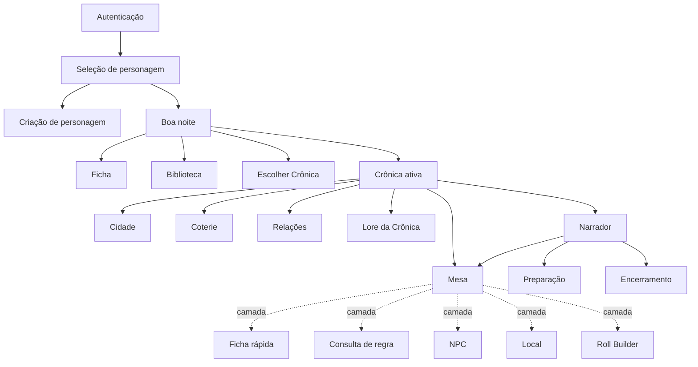
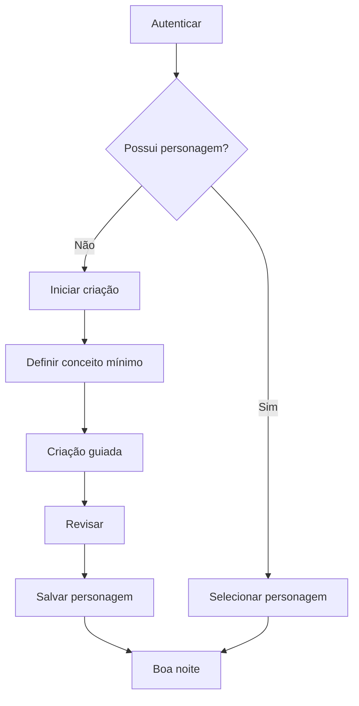
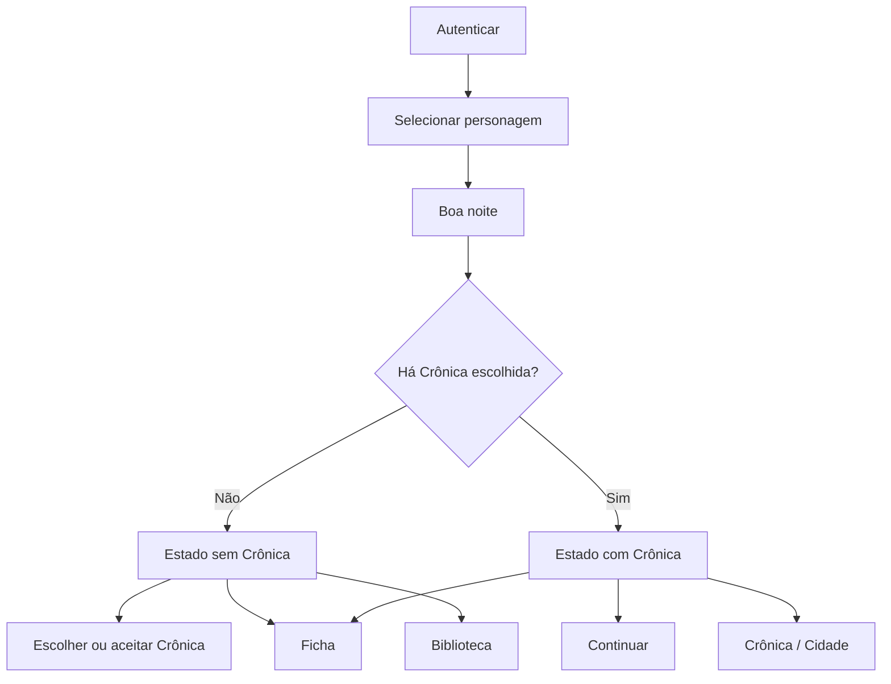
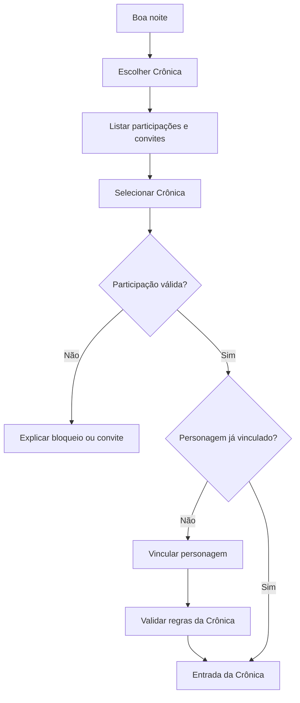
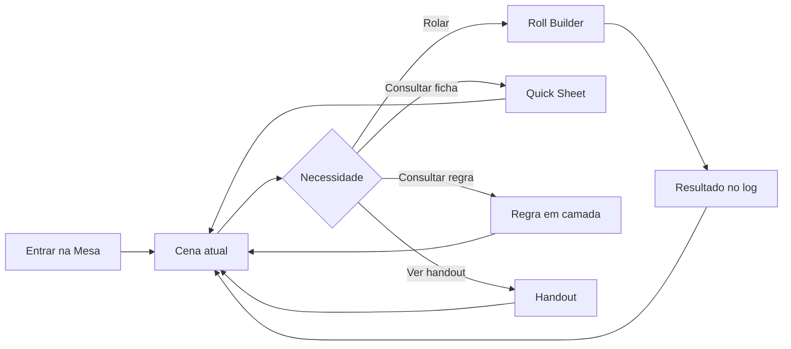
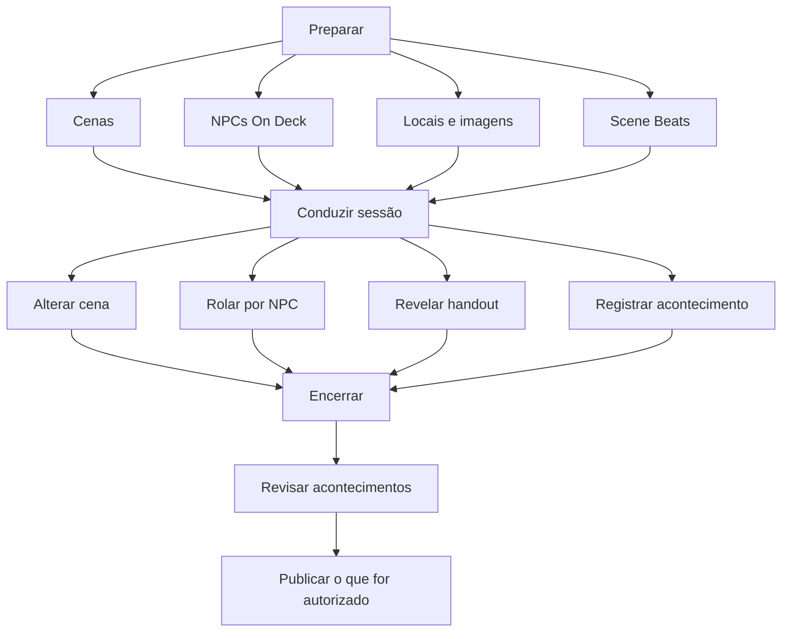
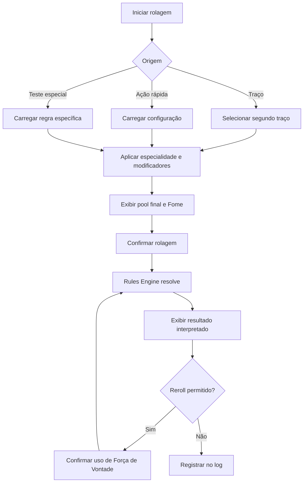

# Product Architecture & Core User Flows v0.1

**Status:** proposta estrutural para validação  
**Data:** 1º de outubro de 2026  
**Fase:** Arquitetura de Produto e Fluxos Principais  
**Próximo documento:** Domain Model v0.1

**Documentos-base:**

- Product & Experience Foundation v0.2;
- Visual Identity & Design Direction v0.1;
- Art System & Screen Archetypes v0.2;
- Reference Board v0.1;
- Visual Calibration — Boa noite, Marcus v0.1.

---

## 1. Propósito

Este documento define como o produto se organiza para o usuário antes da especificação técnica e da implementação.

Ele formaliza:

- atores e papéis;
- contextos de uso;
- superfícies principais;
- hierarquia de navegação;
- fluxos essenciais;
- estados com e sem Crônica;
- diferenças entre Jogador e Narrador;
- persistência de contexto durante a sessão;
- limites do primeiro produto jogável;
- decisões que precisam existir antes do Domain Model e da Architecture v0.1.

Este documento não define:

- tabelas de banco;
- endpoints;
- componentes React;
- provedor de autenticação;
- infraestrutura;
- design tokens finais;
- contratos de eventos;
- regras executáveis detalhadas.

---

## 2. Princípio estrutural

> **O personagem é o centro da experiência do jogador; a Crônica é o contexto compartilhado; a Mesa é o contexto persistente da sessão.**

A arquitetura do produto não será organizada como um catálogo de módulos independentes.

O usuário não deve começar por:

- dashboard;
- lista de ferramentas;
- administração da conta;
- catálogo de livros;
- seleção abstrata de workspace.

O caminho principal é:

```text
Conta
  ↓
Personagem
  ↓
Contexto pessoal
  ↓
Crônica, se houver
  ↓
Sessão / Mesa, quando ativa
```

---

## 3. Vocabulário canônico de produto

| Termo | Significado |
|---|---|
| Usuário | Pessoa autenticada na plataforma. |
| Personagem | Identidade jogável pertencente ao usuário e independente de Crônica. |
| Crônica | Contexto compartilhado de campanha. |
| Participação | Relação entre usuário/personagem e Crônica, contendo papel e permissões. |
| Jogador | Papel exercido dentro de uma Crônica. |
| Narrador | Papel exercido dentro de uma Crônica. |
| Coterie | Grupo ficcional e mecânico de personagens dentro de uma Crônica. |
| Cena | Unidade narrativa preparada ou conduzida pelo Narrador. |
| Mesa | Superfície persistente onde a sessão acontece. |
| Biblioteca | Conteúdo editorial que explica regras e lore. |
| Rules Engine | Sistema determinístico que executa e valida mecânicas. |
| SIRE | Intérprete opcional de conteúdo e contexto autorizado. |

### Regra terminológica

`Jogador` e `Narrador` não são tipos permanentes de conta. São papéis associados a uma Participação em determinada Crônica.

---

## 4. Atores e papéis

### 4.1 Visitante

Pode:

- conhecer a proposta do produto;
- autenticar-se;
- criar uma conta, se aplicável.

Não acessa dados de personagem ou Crônica.

### 4.2 Usuário autenticado

Pode:

- criar e gerenciar personagens próprios;
- acessar Biblioteca autorizada;
- aceitar convites;
- alternar entre personagens;
- participar de diferentes Crônicas com papéis distintos.

### 4.3 Jogador em uma Crônica

Pode, conforme permissão:

- entrar na Mesa;
- acessar seu personagem vinculado;
- visualizar Coterie;
- consultar Cidade e informações publicadas;
- realizar rolagens;
- consultar regras e lore;
- visualizar relações conhecidas;
- receber handouts.

### 4.4 Narrador em uma Crônica

Pode, conforme permissão:

- preparar e conduzir cenas;
- gerenciar NPCs, locais e conteúdo próprio;
- publicar informações;
- visualizar dados secretos;
- auxiliar fichas vinculadas;
- realizar rolagens abertas ou restritas;
- registrar acontecimentos e consequências.

### 4.5 Administrador da plataforma

Papel operacional interno, fora da experiência ficcional.

Não deve ser confundido com Narrador.

---

## 5. Contextos principais

O produto possui quatro contextos explícitos.

### 5.1 Contexto da conta

Escopo:

- autenticação;
- preferências;
- segurança;
- personagens do usuário;
- convites.

### 5.2 Contexto do personagem

Escopo:

- identidade;
- ficha;
- ações rápidas;
- aprendizado contextual;
- relações percebidas;
- diário;
- vínculos com Crônicas.

Pode existir sem Crônica.

### 5.3 Contexto da Crônica

Escopo:

- membros e papéis;
- Coterie;
- cidade;
- locais;
- NPCs;
- relações;
- cenas;
- conteúdo publicado;
- acontecimentos;
- permissões.

### 5.4 Contexto da sessão

Escopo:

- cena atual;
- chat e log;
- rolagens;
- personagem em jogo;
- NPCs em uso;
- handouts;
- consultas temporárias;
- eventos da sessão.

A sessão existe dentro de uma Crônica.

---

## 6. Mapa de superfícies



### Leitura do mapa

- Seleção de personagem é a primeira superfície após autenticação.
- “Boa noite” é a entrada no contexto pessoal.
- Ficha e Biblioteca não dependem de Crônica.
- Cidade, Coterie, Relações compartilhadas e Mesa dependem de Crônica.
- Consultas durante a Mesa abrem como camadas e retornam à cena atual.

---

## 7. Modelo de navegação

### 7.1 Navegação por contexto

A navegação deve refletir onde o usuário está:

```text
Conta → Personagem → Crônica → Sessão
```

Cada nível adiciona contexto, sem apagar os anteriores.

### 7.2 Troca explícita de contexto

Trocar personagem ou Crônica é uma ação deliberada.

O sistema não deve alterar silenciosamente:

- personagem ativo;
- Crônica ativa;
- papel atual;
- sessão ativa.

### 7.3 Navegação global reduzida

Disponível fora da Mesa:

- trocar personagem;
- acessar ficha;
- acessar Biblioteca;
- acessar Crônica ativa;
- conta e preferências.

A forma visual varia conforme o arquétipo da tela. Uma entrada imersiva não precisa exibir uma navbar completa.

### 7.4 Camadas contextuais

Durante a Mesa, abrir como drawer, painel ou overlay:

- ficha rápida;
- Roll Builder;
- regra;
- NPC;
- local;
- relação;
- handout.

Ao fechar, o usuário retorna à mesma cena e ao mesmo estado de sessão.

### 7.5 Navegação profunda

Quando o conteúdo exigir trabalho prolongado, a camada pode expandir para uma superfície completa.

Exemplos:

- editar ficha;
- editar NPC;
- ler lore extensa;
- preparar uma cena.

O retorno deve preservar o contexto de origem sempre que tecnicamente possível.

---

## 8. Fluxo 01 — Primeiro acesso

### Objetivo

Levar um novo usuário da autenticação até um personagem utilizável sem apresentar toda a complexidade da plataforma.



### Regras

- criação pode ser interrompida e retomada;
- explicações são opcionais;
- veteranos podem avançar sem abrir conteúdo didático;
- o personagem nasce independente de Crônica;
- vínculo com Crônica não é obrigatório para concluir a criação.

### Estado vazio

Se o usuário não possui personagens, a seleção deve comunicar claramente:

- por que criar;
- quanto progresso será necessário;
- que o personagem pode existir sem campanha.

---

## 9. Fluxo 02 — Retorno de usuário



### Regra de entrada

`Continuar` leva à atividade mais relevante e segura, seguindo prioridade a ser validada:

1. sessão ativa;
2. cena ou preparação explicitamente marcada;
3. visão da Crônica;
4. último contexto válido.

Nunca levar automaticamente para conteúdo secreto ou estado de edição.

---

## 10. Fluxo 03 — Personagem sem Crônica

### Ações principais

- escolher uma Crônica existente;
- aceitar convite;
- acessar ficha;
- consultar Biblioteca;
- continuar desenvolvendo o personagem.

### Restrições

Não exibir como disponíveis:

- Mesa;
- Coterie compartilhada;
- Cidade da Crônica;
- NPCs da Crônica;
- lore publicada de Crônica;
- relações secretas ou compartilhadas.

### Princípio

Ausência de Crônica é um estado válido, não um erro ou onboarding incompleto.

---

## 11. Fluxo 04 — Entrada em uma Crônica



### Decisões pendentes

- um personagem pode estar em múltiplas Crônicas simultaneamente?
- vínculo reutiliza o mesmo estado ou cria uma projeção por Crônica?
- Narrador pode criar personagens para jogadores?
- troca de personagem dentro da mesma Crônica é permitida?

Essas decisões precisam ser fechadas no Domain Model v0.1.

---

## 12. Fluxo 05 — Mesa do Jogador

### Objetivo

Participar da sessão mantendo cena e contexto visíveis.



### Elementos persistentes

- cena atual;
- identificação do personagem;
- acesso ao chat/log;
- entrada para rolagem;
- indicação de estado de conexão.

### Elementos temporários

- ficha rápida;
- regra;
- detalhe de poder;
- local;
- relação;
- handout ampliado.

### Falhas e retomada

- reconexão não pode duplicar rolagens;
- ações pendentes devem indicar seu estado;
- usuário reconectado deve retornar à cena atual;
- log é a referência para eventos confirmados.

---

## 13. Fluxo 06 — Ciclo do Narrador



### Regra operacional

O Narrador não deve manter todos os NPCs, Clocks, locais e anotações abertos simultaneamente.

A Mesa apresenta o necessário para a cena atual. O restante permanece acessível por busca e camadas.

### Confirmação humana

Alterações narrativas importantes exigem confirmação explícita do Narrador.

Automação pode:

- registrar;
- relacionar;
- sugerir;
- preparar uma mudança.

Automação não pode decidir consequências ficcionais sozinha.

---

## 14. Fluxo 07 — Ficha e rolagem

### Níveis da ficha

```text
Resumo → Quick Sheet → Ficha completa
```

### Modo Jogar

Permite:

- alterar estados temporários autorizados;
- iniciar rolagens;
- usar ações rápidas;
- consultar poderes;
- aplicar reroll quando elegível.

### Modo Editar

Permite:

- alterações estruturais;
- progressão;
- histórico e justificativa;
- assistência do Narrador conforme permissão.

### Fluxo de rolagem



### Regra de responsabilidade

- interface coleta intenção;
- Rules Engine resolve a mecânica;
- animação representa o resultado;
- log registra o evento confirmado.

---

## 15. Fluxo 08 — Biblioteca e consulta contextual

### Entradas possíveis

- navegação direta pela Biblioteca;
- busca global;
- clique em um termo da ficha;
- consulta durante criação;
- consulta durante a Mesa;
- link originado pelo SIRE.

### Profundidade progressiva

```text
Definição curta
  ↓
Explicação contextual
  ↓
Exemplo
  ↓
Regra completa
  ↓
Fonte e proveniência
```

### Retorno

Ao fechar uma consulta contextual, o usuário retorna ao ponto exato de origem.

### Separação obrigatória

- Biblioteca explica;
- Rules Engine executa;
- SIRE interpreta conteúdo autorizado.

---

## 16. Busca global

### Escopo variável

A busca considera o contexto atual:

- conta;
- personagem;
- Crônica;
- papel;
- permissões;
- sessão.

### Categorias de resultado

- regra;
- lore;
- personagem;
- NPC;
- local;
- relação;
- cena;
- handout;
- acontecimento.

### Segurança

Resultado proibido não deve ser recuperado para depois ser ocultado na interface.

O filtro ocorre antes da recuperação e antes de qualquer integração com IA.

---

## 17. Permissões como requisito de produto

Permissões não podem ser tratadas apenas como detalhe técnico posterior.

### Dimensões mínimas

- usuário;
- Crônica;
- papel;
- personagem;
- tipo de recurso;
- propriedade;
- visibilidade;
- estado de publicação.

### Estados preliminares de visibilidade

- privado do autor;
- privado do Narrador;
- compartilhado com pessoa específica;
- compartilhado com Coterie;
- publicado para a Crônica;
- público da plataforma, quando aplicável.

### Regra de negação

Na dúvida, negar acesso e apresentar uma mensagem compreensível.

---

## 18. Estados transversais obrigatórios

Cada superfície deverá especificar:

- carregando;
- vazia;
- sucesso;
- erro recuperável;
- erro de permissão;
- offline ou reconectando;
- conteúdo removido;
- conteúdo ainda não publicado;
- sessão encerrada;
- conflito de edição, quando aplicável.

Nenhuma tela é considerada especificada apenas com seu estado ideal.

---

## 19. Modelo conceitual de rotas

As rotas abaixo são conceituais e não constituem contrato técnico final.

```text
/login
/characters
/characters/new
/characters/:characterId
/characters/:characterId/sheet
/characters/:characterId/library
/characters/:characterId/chronicles

/chronicles/:chronicleId
/chronicles/:chronicleId/city
/chronicles/:chronicleId/coterie
/chronicles/:chronicleId/relations
/chronicles/:chronicleId/storyteller
/chronicles/:chronicleId/scenes

/chronicles/:chronicleId/session
```

### Regras

- identificadores da URL não concedem permissão;
- personagem e Crônica precisam ser compatíveis;
- links profundos devem restaurar contexto autorizado;
- uma sessão ativa não pode depender somente de estado local do navegador.

---

## 20. Corte vertical recomendado para a primeira versão

### Vertical Slice 01 — núcleo jogável

```text
Autenticar
  ↓
Selecionar personagem existente
  ↓
Boa noite
  ↓
Abrir ficha
  ↓
Montar rolagem
  ↓
Resolver regra
  ↓
Publicar resultado no log da Mesa
```

### Incluído

- autenticação mínima;
- um personagem de teste;
- ficha mínima em Modo Jogar;
- Atributos e Habilidades necessários ao teste;
- Fome;
- Roll Builder;
- resolução de sucessos;
- resultado textual;
- log persistido;
- uma Crônica e uma sessão de teste;
- permissões mínimas entre Jogador e Narrador.

### Excluído deste corte

- criação completa de personagem;
- dados 3D finais;
- mapa;
- relações;
- SIRE;
- Refúgio;
- Coterie completa;
- lore extensa;
- tradução automatizada;
- GraphRAG;
- VTT tático.

### Por que este corte

Ele valida cedo:

- autenticação e autorização;
- relação User–Character–Chronicle;
- Rules Engine;
- realtime ou atualização de log;
- persistência;
- retorno contextual;
- fronteira entre interface e regra.

---

## 21. Sequência de incrementos

### Incremento 1 — núcleo jogável

Vertical Slice 01.

### Incremento 2 — criação e aprendizado

- criação guiada;
- explicação contextual;
- ficha completa;
- ações rápidas.

### Incremento 3 — preparação do Narrador

- cenas;
- Scene Beats;
- NPCs On Deck;
- mudança de cena;
- handouts.

### Incremento 4 — conhecimento

- Biblioteca inicial;
- busca;
- proveniência;
- conteúdo relacionado.

### Incremento 5 — mundo compartilhado

- Cidade;
- Coterie;
- relações;
- conteúdo publicado da Crônica.

### Incremento 6 — assistência opcional

- SIRE;
- recuperação autorizada;
- resumos e sugestões;
- inteligência de Crônica.

---

## 22. Guardrails de engenharia

### 22.1 Sem regra crítica apenas no frontend

Validações de autorização e mecânica precisam existir em camada confiável.

### 22.2 Sem segredo enviado para depois ser escondido

Dados proibidos não chegam ao cliente nem ao modelo de IA.

### 22.3 Sem estado importante apenas em memória local

Rolagens confirmadas, mudanças de ficha e eventos de sessão precisam de persistência e identidade.

### 22.4 Sem duplicação de fonte de verdade

- texto editorial não valida mecânica;
- animação de dados não calcula resultado;
- UI não decide permissão;
- IA não define canon.

### 22.5 Sem arquitetura genérica antecipada

Não criar microsserviços, filas, event sourcing completo ou GraphRAG antes de uma necessidade comprovada.

### 22.6 Modularidade desde o monólito

A primeira arquitetura pode ser um monólito modular, desde que os limites de domínio estejam explícitos e testáveis.

### 22.7 Migrações e histórico

Mudanças de schema e conteúdo precisam ser versionadas. Alterações relevantes de personagem e Crônica precisam ser auditáveis conforme o risco.

---

## 23. Qualidades obrigatórias

### Segurança

- autorização por recurso;
- proteção de segredos;
- princípio do menor privilégio;
- trilha para ações sensíveis.

### Acessibilidade

- navegação por teclado;
- foco visível;
- contraste;
- texto redimensionável;
- redução de movimento;
- semântica adequada.

### Desempenho percebido

- entrada rápida;
- skeletons apenas quando úteis;
- imagens responsivas;
- camadas contextuais leves;
- recuperação de sessão previsível.

### Confiabilidade

- rolagens idempotentes quando submetidas;
- reconexão segura;
- persistência de eventos confirmados;
- falhas apresentadas de forma recuperável.

### Evolução

- suporte explícito a `edition`;
- conteúdo com proveniência;
- personagem portável;
- módulos avançados opt-in.

---

## 24. Decisões aprovadas por este documento

1. Seleção de personagem sucede autenticação.
2. Personagem pode existir sem Crônica.
3. “Boa noite” é a entrada do contexto do personagem.
4. Papel pertence à Participação na Crônica.
5. Mesa é contexto persistente durante a sessão.
6. Consultas rápidas abrem em camadas.
7. Biblioteca, Rules Engine e SIRE são responsabilidades distintas.
8. Permissões fazem parte da arquitetura do produto.
9. O primeiro corte vertical termina com uma rolagem persistida no log.
10. O primeiro sistema deve favorecer monólito modular, não distribuição prematura.

---

## 25. Questões que bloqueiam o Domain Model final

### Personagem e Crônica

- o mesmo Character pode manter estado compartilhado entre Crônicas?
- haverá snapshot ou variação por Crônica?
- como ocorre saída de uma Crônica?

### Participação

- usuário pode possuir mais de um papel na mesma Crônica?
- Narrador também pode controlar um personagem jogador?
- convite é enviado para usuário, personagem ou ambos?

### Propriedade e edição

- quais alterações do Narrador exigem aceite do jogador?
- quais mudanças geram histórico obrigatório?
- como resolver edição concorrente?

### Sessão

- sessão possui início e encerramento formais?
- existe apenas uma cena ativa?
- rolagens podem ser privadas, secretas ou atrasadas?

### Conteúdo

- qual conteúdo estará juridicamente disponível na primeira versão?
- quais estados de revisão e tradução entram no MVP?

---

## 26. Definition of Ready para Architecture v0.1

A arquitetura técnica poderá ser formalizada quando existirem:

- aprovação dos fluxos principais;
- decisão sobre Character em múltiplas Crônicas;
- matriz inicial de papéis e permissões;
- escopo fechado do Vertical Slice 01;
- Domain Model v0.1;
- regras mínimas de rolagem selecionadas;
- requisitos de realtime definidos;
- política inicial de conteúdo e licenciamento.

---

## 27. Próximos documentos

### 1. Domain Model v0.1

Definir:

- entidades;
- value objects;
- agregados;
- invariantes;
- ownership;
- eventos de domínio;
- fronteiras entre módulos.

### 2. Permissions & Visibility Matrix v0.1

Definir acesso por papel, recurso, propriedade e estado de publicação.

### 3. Rules Engine Scope v0.1

Definir a primeira mecânica executável e seus contratos.

### 4. Architecture v0.1

Definir contexto, containers, módulos, persistência, realtime, segurança e implantação.

### 5. ADRs iniciais

Registrar decisões irreversíveis ou de alto impacto com contexto e alternativas.

---

## 28. Princípio final

> **A arquitetura deve absorver a complexidade do domínio para que a experiência permaneça simples, segura e imersiva.**

O projeto não iniciará pela soma de telas nem pela instalação de tecnologias.

Ele iniciará por:

1. fluxo compreendido;
2. domínio explícito;
3. responsabilidades separadas;
4. decisões registradas;
5. primeiro corte vertical testável.

Essa ordem reduz retrabalho, evita acoplamento acidental e permite construir o produto de forma profissional sem antecipar complexidade desnecessária.
