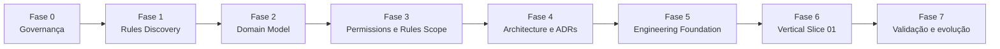

# Roadmap de Engenharia v0.1

**Status:** plano de execução atual  
**Data:** 1º de outubro de 2026  
**Horizonte:** descoberta de regras até primeiro corte executável

---

## 1. Objetivo

Organizar a evolução do projeto em fases verificáveis, com decisões explícitas, riscos controlados e entregas pequenas.

O roadmap evita:

- começar pela tecnologia;
- modelar regras por memória;
- implementar toda a plataforma de uma vez;
- fechar telas antes dos fluxos;
- distribuir o sistema prematuramente;
- adicionar IA antes de permissões e fontes confiáveis;
- versionar livros e assets sem autorização.

---

## 2. Princípios de engenharia adotados

### Domain-Driven Design

- linguagem ubíqua;
- limites de domínio explícitos;
- modelo construído a partir de regras reais;
- separação entre Core, Game Rules e Knowledge.

### Clean Architecture

- regra de negócio independente de framework;
- dependências apontam para o domínio;
- UI, banco e serviços externos são detalhes substituíveis.

### Arquitetura evolutiva

- decisões reversíveis permanecem simples;
- decisões difíceis são registradas;
- qualidade é verificada continuamente;
- decomposição ocorre quando houver evidência.

### Entrega contínua

- branches curtas;
- commits pequenos;
- build reproduzível;
- testes automatizados;
- integração frequente;
- deploy sem depender de mudanças manuais ocultas.

### Vertical slicing

Cada incremento atravessa UI, domínio, persistência e testes, entregando comportamento observável.

---

## 3. Visão das fases



---

## 4. Fase 0 — Governança e baseline documental

### Entregas

- README do projeto;
- índice da documentação;
- roadmap;
- registro de decisões;
- política de contribuição;
- `.gitignore` protegendo conteúdo privado;
- templates de ADR e regra.

### Critério de saída

- repositório pode ser clonado em outro computador;
- documentos possuem ordem de leitura;
- nenhuma fonte protegida está versionada;
- próximos passos estão explícitos.

### Estado

**Concluído nesta baseline.**

---

## 5. Fase 1 — Rules & Content Discovery v0.1

### Objetivo

Construir um corpus mínimo e rastreável para modelar a primeira mecânica executável.

### Escopo inicial

- edição V5;
- testes básicos;
- parada de dados;
- dificuldade;
- Fome;
- sucessos e falhas;
- críticos;
- Crítico Sangrento;
- Falha Bestial;
- reroll com Força de Vontade.

### Entregas

- inventário de fontes;
- glossário inicial;
- regras estruturadas pelo template;
- matriz regra → fonte → exemplo → teste;
- dúvidas e conflitos registrados;
- decisão jurídica sobre o que pode entrar no Git.

### Critério de saída

- todas as regras do primeiro Roll Builder possuem fonte;
- exceções conhecidas estão registradas;
- exemplos podem virar testes determinísticos;
- nenhuma regra depende apenas de interpretação informal.

---

## 6. Fase 2 — Domain Model v0.1

### Objetivo

Formalizar linguagem, entidades, agregados, invariantes e eventos.

### Módulos candidatos

```text
Identity & Access
Character
Chronicle
Session
Game Rules
Knowledge
Media
```

### Decisões prioritárias

- Character canônico versus estado por Crônica;
- Membership e papéis;
- propriedade e edição de ficha;
- sessão, cena e log;
- Roll como evento imutável;
- edição e versionamento de regra;
- proveniência de conteúdo.

### Entregas

- mapa de bounded contexts;
- glossário canônico;
- agregados e invariantes;
- eventos de domínio;
- diagramas conceituais;
- riscos de consistência.

### Critério de saída

- o primeiro corte vertical pode ser explicado sem citar framework ou banco;
- invariantes possuem responsável claro;
- fronteiras entre conteúdo e regra são explícitas;
- termos ambíguos foram eliminados ou registrados.

---

## 7. Fase 3 — Permissões e escopo do Rules Engine

### Entregas

- Permissions & Visibility Matrix v0.1;
- Rules Engine Scope v0.1;
- estados de publicação;
- política de segredo;
- contratos conceituais de rolagem;
- cenários Given/When/Then.

### Critério de saída

- cada operação do corte vertical possui ator autorizado;
- dados proibidos são filtrados antes da recuperação;
- entradas e saídas do Rules Engine estão definidas;
- reroll, idempotência e auditoria possuem comportamento conhecido.

---

## 8. Fase 4 — Architecture v0.1 e ADRs

### Entregas

- diagrama de contexto C4;
- diagrama de containers;
- módulos do monólito;
- persistência;
- autenticação e autorização;
- estratégia de realtime;
- armazenamento de mídia;
- limites de integração com IA;
- implantação inicial;
- ADRs das decisões relevantes.

### ADRs mínimos previstos

1. escolha do estilo arquitetural;
2. stack web;
3. persistência relacional;
4. autenticação;
5. autorização por recurso;
6. estratégia de realtime;
7. separação entre conteúdo e regra;
8. versionamento por edição;
9. log de atividade;
10. armazenamento de assets.

### Critério de saída

- trade-offs estão documentados;
- dependências externas possuem justificativa;
- segurança e operação foram consideradas;
- a arquitetura suporta o corte vertical sem antecipar o produto inteiro.

---

## 9. Fase 5 — Engineering Foundation

### Entregas

- estrutura do projeto;
- gerenciador de dependências e lockfile;
- lint e formatação;
- testes unitários e de integração;
- validação de tipos;
- pipeline de CI;
- ambiente local documentado;
- migrações de banco;
- dados de desenvolvimento seguros;
- observabilidade mínima;
- política de branches e releases.

### Quality gates iniciais

- build reproduzível;
- lint sem erros;
- typecheck sem erros;
- testes verdes;
- nenhuma credencial no Git;
- migração aplicável em banco vazio;
- documentação de setup validada em máquina limpa.

### Critério de saída

Um novo colaborador consegue clonar, configurar, testar e executar o esqueleto seguindo somente o README.

---

## 10. Fase 6 — Vertical Slice 01

### Fluxo

```text
Autenticar
→ Selecionar personagem
→ Boa noite
→ Abrir ficha
→ Montar rolagem
→ Resolver regra
→ Registrar resultado no log da Mesa
```

### Entregas funcionais

- autenticação mínima;
- personagem de teste;
- Crônica e Membership de teste;
- ficha mínima;
- Roll Builder;
- Fome;
- Rules Engine determinístico;
- log persistido;
- visualização por Jogador e Narrador;
- tratamento de erro e reconexão essencial.

### Estratégia de testes

- unitários para regras puras;
- tabelados para resultados e exceções;
- integração para persistência e autorização;
- contrato para eventos;
- ponta a ponta para o caminho crítico;
- acessibilidade automatizada básica;
- revisão manual da experiência visual.

### Critério de saída

- fluxo completo executável;
- resultados reproduzíveis;
- autorização validada no backend;
- log não duplica submissões;
- falhas críticas são observáveis;
- documentação corresponde ao comportamento.

---

## 11. Fase 7 — Validação e evolução

### Atividades

- testar com jogadores e Narradores;
- medir fricção;
- revisar linguagem;
- corrigir modelo com evidência;
- priorizar próximo corte;
- registrar novas decisões em ADRs.

### Próximos cortes candidatos

1. criação guiada;
2. Scene Beats e mudança de cena;
3. NPCs On Deck;
4. Biblioteca contextual;
5. Cidade e locais;
6. Coterie e relações;
7. SIRE.

---

## 12. Estratégia de branches e releases

### Durante documentação

- `main` deve permanecer utilizável como fonte de verdade;
- mudanças maiores entram por branch e pull request;
- versões relevantes recebem tag.

### Sugestão de tags

```text
docs-baseline-v0.1
domain-model-v0.1
architecture-v0.1
vertical-slice-v0.1
```

### Releases

Não usar versão `1.0.0` antes de existir produto jogável e política de compatibilidade.

---

## 13. Riscos principais

| Risco | Impacto | Tratamento |
|---|---:|---|
| Escopo amplo demais | alto | cortes verticais e critérios de saída |
| Regras interpretadas incorretamente | alto | proveniência, exemplos e revisão |
| Vazamento de segredos da Crônica | alto | autorização antes da recuperação |
| Conteúdo sem licença | alto | corpus privado fora do Git e revisão jurídica |
| UI bonita sem fluxo sustentável | médio/alto | IA antes de novas telas finais |
| Acoplamento de regra à UI | alto | domínio e Rules Engine independentes |
| Realtime complexo prematuramente | médio | validar necessidade no primeiro corte |
| Microsserviços prematuros | médio/alto | monólito modular inicial |
| Dependência obrigatória de IA | alto | produto funcional sem IA |
| Ausência de testes de regras | alto | exemplos executáveis e testes tabelados |

---

## 14. Métricas de saúde do projeto

### Produto

- tempo até primeira rolagem;
- passos para abrir uma regra contextual;
- capacidade de retomar sessão sem perder contexto;
- compreensão por iniciante;
- trabalho administrativo do Narrador.

### Engenharia

- build e testes verdes;
- tempo de feedback da CI;
- defeitos por regra alterada;
- migrações reversíveis ou recuperáveis;
- incidentes de autorização;
- diferença entre documentação e comportamento.

### Arquitetura

- dependências entre módulos;
- regras puras sem dependência de infraestrutura;
- cobertura dos cenários críticos;
- quantidade de decisões não registradas;
- capacidade de substituir integrações externas.

---

## 15. Referências metodológicas

Este plano é influenciado por princípios apresentados em:

- *Domain-Driven Design*, Eric Evans;
- *Implementing Domain-Driven Design*, Vaughn Vernon;
- *Clean Architecture*, Robert C. Martin;
- *Fundamentals of Software Architecture*, Mark Richards e Neal Ford;
- *Building Evolutionary Architectures*, Neal Ford, Rebecca Parsons e Patrick Kua;
- *Software Architecture: The Hard Parts*, Neal Ford, Mark Richards, Pramod Sadalage e Zhamak Dehghani;
- *Designing Data-Intensive Applications*, Martin Kleppmann;
- *Continuous Delivery*, Jez Humble e David Farley;
- *Accelerate*, Nicole Forsgren, Jez Humble e Gene Kim;
- *User Story Mapping*, Jeff Patton.

As referências orientam o raciocínio. Elas não substituem decisões baseadas nas restrições reais do produto.

---

## 16. Próxima ação concreta

1. adicionar localmente as fontes permitidas, fora do Git;
2. preencher o inventário de fontes;
3. selecionar as seções do primeiro recorte;
4. produzir especificações de regras usando o template;
5. transformar exemplos em cenários de teste;
6. elaborar o Domain Model v0.1 com base nas evidências.
