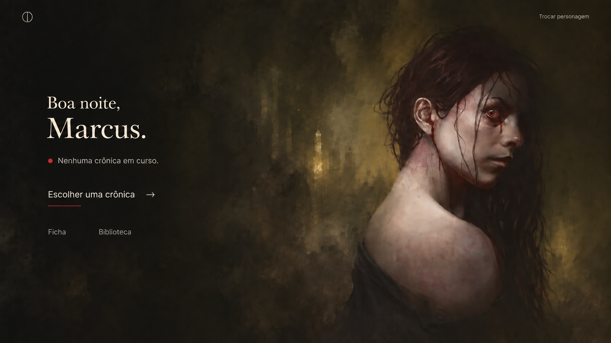

# Visual Calibration — Boa noite, Marcus v0.1

**Status:** aprovado 
**Uso:** direção de experiência 
**Data de aprovação:** 30 de setembro de 2026  
**Tipo:** calibração visual, não especificação final de interface  
**Arquétipo:** Immersive Entry / Hero  
**Art Level:** 4  
**Densidade:** D1

**Documentos-base:**

- Product & Experience Foundation v0.2;
- Visual Identity & Design Direction v0.1;
- Art System & Screen Archetypes v0.2;
- Reference Board v0.1.

---

## 1. Artefato aprovado

Arquivo:

`referencias-visuais/boa-noite-marcus-visual-calibration-v01.png`

### 1.1 Proveniência e estado de uso

| Campo | Registro |
|---|---|
| origem | variante gerada para este projeto a partir da imagem-conceito fornecida pelo responsável durante a conversa de calibração |
| referência direta | imagem-conceito usada na conversa; o arquivo original não integra este repositório |
| ferramenta | serviço de edição e geração de imagens da OpenAI; versão do modelo não registrada |
| base criativa | imagem-conceito, briefing, decisões visuais e revisão conduzidos pelo responsável do projeto |
| função atual | protótipo interno e referência de direção, não asset final de produção |
| reprodução de terceiro | não registrada como reprodução licenciada de uma obra específica |
| publicação ou uso comercial | pendente de revisão dos termos aplicáveis e de eventuais direitos de terceiros |

Antes de uma divulgação pública, o projeto deverá preservar o registro de geração disponível, confirmar o direito de uso pretendido e substituir o asset se essa confirmação não for suficiente.

---

## 2. Objetivo validado

A tela deve comunicar:

> **“voltei para a noite de Marcus.”**

Ela não deve comunicar:

> “abri a página inicial de um software.”

A calibração valida a transição entre a identidade do usuário e o mundo do personagem. A tela não é um dashboard e não pretende expor toda a arquitetura de navegação.

---

## 3. Decisões aprovadas

### 3.1 Arte como voz dominante

- a pintura ocupa a maior parte da percepção visual;
- a personagem e seu olhar constituem o centro emocional;
- a UI utiliza o espaço negativo já presente na composição;
- a arte não funciona apenas como wallpaper decorativo.

### 3.2 Uma ação principal

`Escolher uma crônica` é a única ação primária no estado sem Crônica ativa.

`Ficha` e `Biblioteca` permanecem como acessos secundários, sem competir com a entrada narrativa.

### 3.3 Navegação reduzida

Foram removidos da calibração:

- navbar convencional;
- rotas duplicadas;
- indicador “Personagem ativo”;
- repetição do nome Marcus no canto superior;
- grandes divisores e estruturas de dashboard.

Permanecem apenas:

- marca discreta;
- ação para trocar personagem;
- conteúdo essencial da entrada.

### 3.4 Linguagem

Foi aprovado o uso de linguagem menos administrativa:

- evitar `Sem Crônica ativa` como rótulo de sistema;
- preferir `Nenhuma crônica em curso` como estado narrativo e compreensível.

### 3.5 Vermelho como ruptura

O vermelho aparece somente em:

- pequeno indicador de estado;
- acento curto da ação primária.

Ele não constitui a cor estrutural dominante da tela.

---

## 4. Direção tipográfica validada

A calibração rejeita serifas de alto contraste que remetam excessivamente a:

- revista de moda;
- perfume ou luxo genérico;
- formalidade clássica distante;
- gótico ornamental.

A direção aprovada é:

- serif editorial humanista para títulos;
- sans humanista e legível para interface;
- traços resistentes sobre fundos texturizados;
- marfim quente em vez de branco puro;
- hierarquia obtida por escala, ritmo e posição.

Pares preliminares para o Typography Study:

1. Newsreader + IBM Plex Sans;
2. Fraunces + Source Sans 3;
3. Source Serif 4 + IBM Plex Sans.

Nenhuma família tipográfica está fechada por esta calibração.

---

## 5. Relação com benchmarks de produto

### Alchemy RPG

Adotar:

- cena e atmosfera no centro;
- interface recuada;
- sensação de passagem para o mundo;
- poucos controles visíveis no primeiro momento.

Não copiar:

- estrutura completa de VTT;
- dependência de motion ou mídia contínua para produzir imersão.

### Demiplane / Vampire Nexus

Adotar:

- personagem como ponto de entrada;
- caminhos claros para ficha e conteúdo;
- informação contextual sob demanda.

Superar nesta experiência:

- aparência predominantemente operacional;
- entrada orientada primeiro à ferramenta.

### Roll20 e VTTs generalistas

Usar como contraste:

- não exibir toolbars, grid, macros ou gerenciamento na entrada;
- não apresentar toda a capacidade do sistema simultaneamente;
- não transformar a primeira tela do personagem em mesa de controle.

---

## 6. O que esta aprovação não fecha

Esta calibração não define:

- família tipográfica final;
- medidas e tokens finais;
- marca definitiva;
- navegação global definitiva;
- comportamento mobile;
- arte final de produção;
- microcopy de todos os estados;
- acessibilidade medida em implementação.

---

## 7. Requisitos para implementação futura

- texto deve permanecer em HTML/CSS, nunca rasterizado na pintura;
- `Trocar personagem` deve possuir área interativa adequada, mesmo sendo visualmente discreto;
- foco por teclado deve ser claramente perceptível;
- links secundários precisam cumprir contraste acessível;
- desktop e mobile devem possuir crops dirigidos separadamente;
- redução de movimento deve ser respeitada;
- a imagem deve possuir fallback e carregamento progressivo;
- a tela precisa continuar funcional caso a arte ainda não tenha carregado.

---

## 8. Regra de não repetição

Esta composição não se torna um template universal.

Evitar repetir automaticamente em todas as telas:

> texto à esquerda + personagem à direita + fundo escuro.

Cada tela Art Level 3–4 deverá nascer de sua própria intenção emocional, art plate, foco, luz e safe zones.

---

## 9. Resultado

A calibração está aprovada porque equilibra:

- emoção e clareza;
- arte e função;
- silêncio e orientação;
- personagem e mundo;
- identidade própria e padrões já validados em produtos imersivos de RPG.

Ela pode ser usada como referência de qualidade para as próximas experiências, sem ser tratada como especificação pronta para desenvolvimento.
